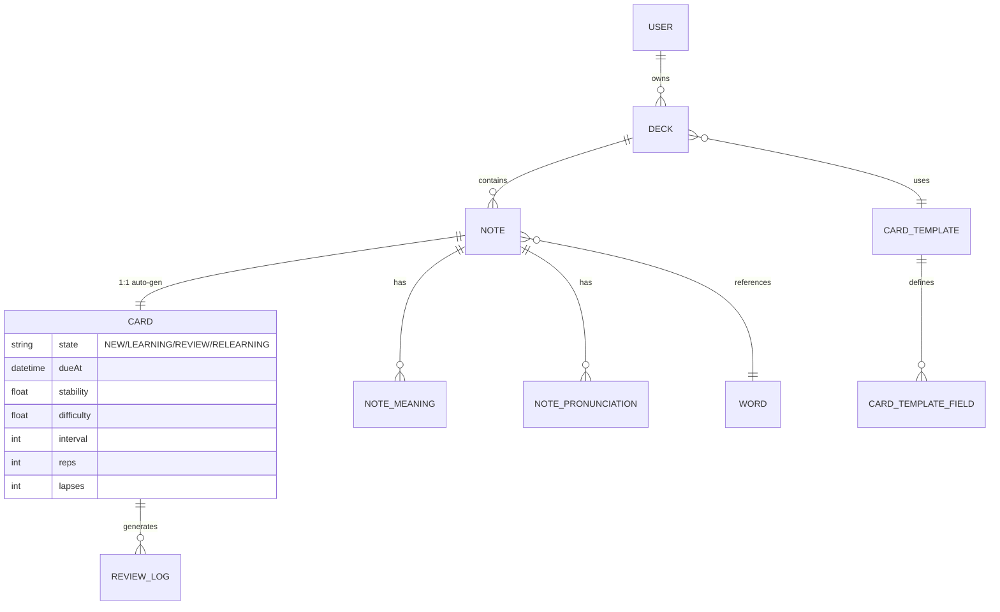
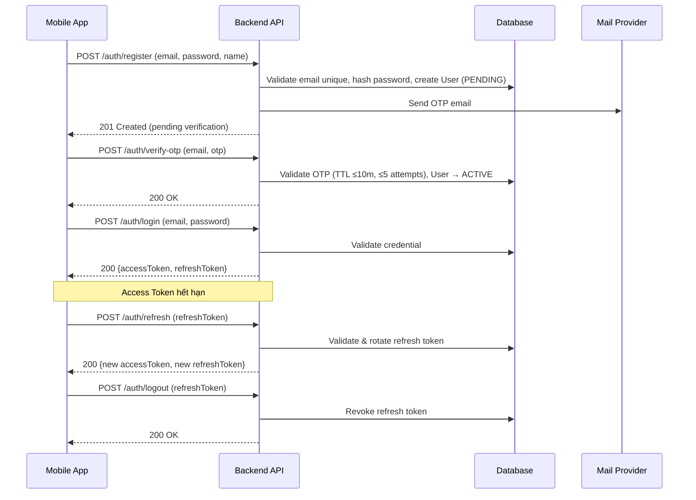
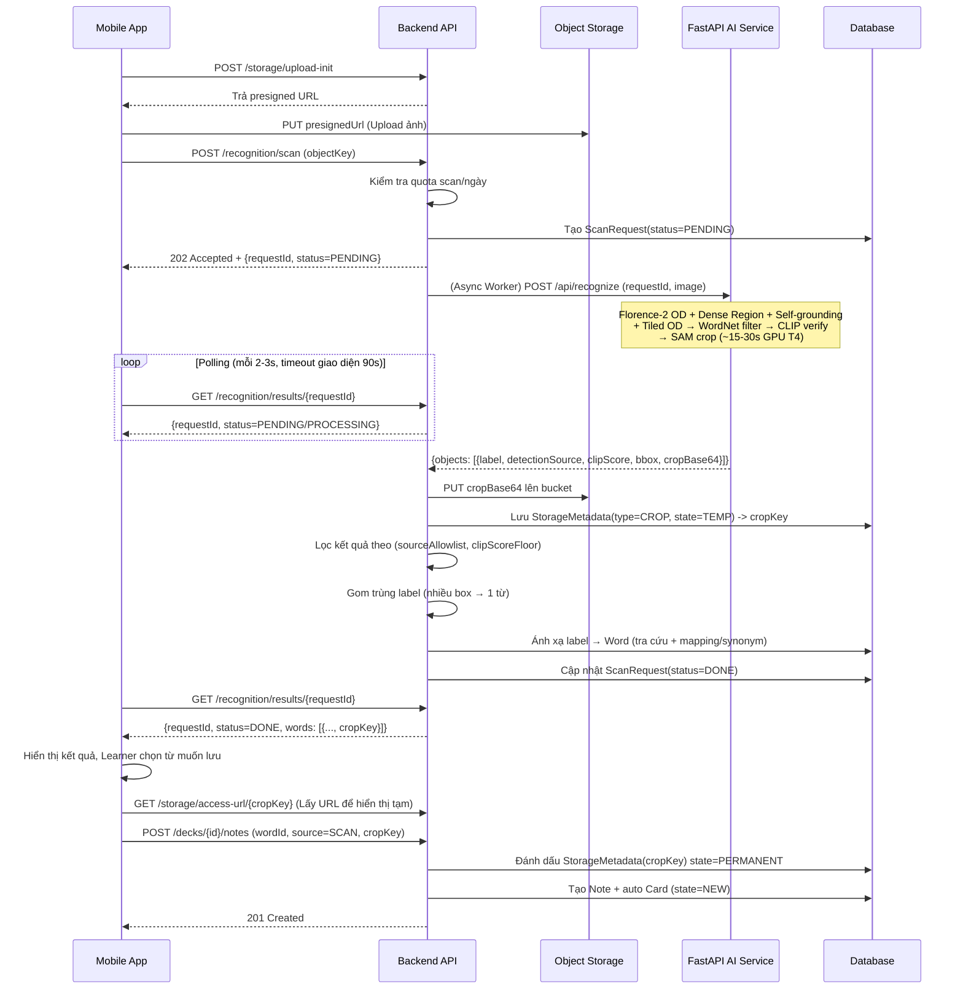
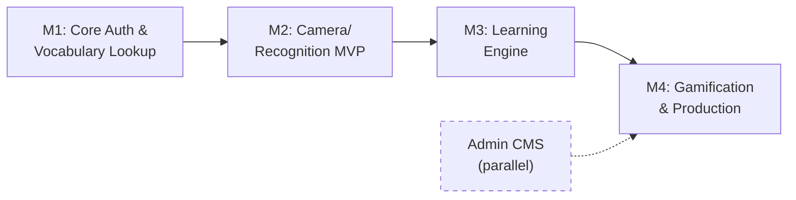
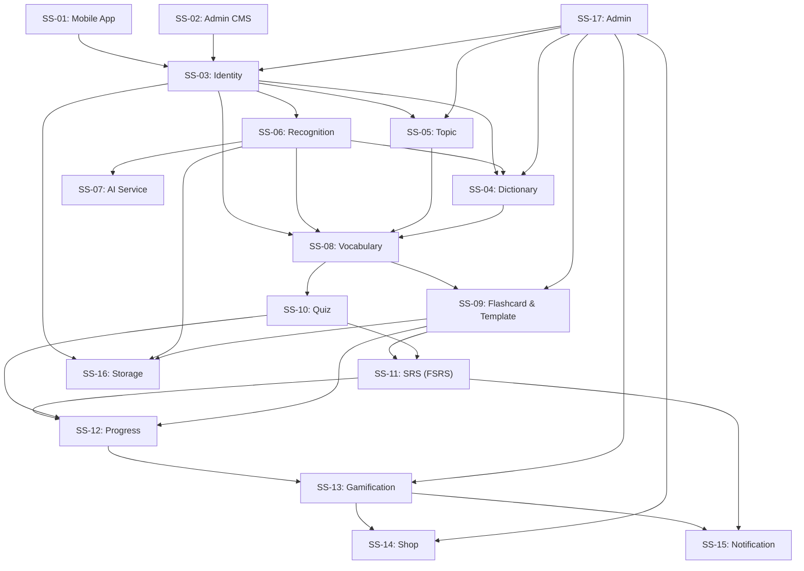

# System Architecture — SnapVocab

> Tài liệu kiến trúc hệ thống tổng thể cho SnapVocab, được xây dựng dựa trên [specs.md](../spec/specs.md), [buss_mainflow.md](../spec/buss_mainflow.md), [phan_ra_phan_he_he_thong.md](../spec/phan_ra_phan_he_he_thong.md), [phan_ra_tinh_nang.md](../spec/phan_ra_tinh_nang.md) và [phan_ra_man_hinh.md](../spec/phan_ra_man_hinh.md).

>
> **Canonical sync (2026-08-23):** Source = [`../spec/specs.md`](../spec/specs.md). AI = Florence-2+SAM+CLIP (F2-v13) · Learning = Deck/Note/Card · SRS = FSRS · Actors = Guest/Learner/Admin · FR: Game=09, Noti=10, Storage=11, OpenAPI=12, Admin=13 · 4 milestones.

---

## 1. Mục tiêu kiến trúc

SnapVocab là hệ thống mobile-first hỗ trợ học từ vựng tiếng Anh thông qua nhận diện hình ảnh (open-vocabulary). Kiến trúc được thiết kế để tách rõ Mobile App, Backend nghiệp vụ, AI Service, Database, Cache và Object Storage, triển khai theo milestone và dễ mở rộng.

### 1.1 Mục tiêu chính

- **Scan-to-learn end-to-end**: Learner chụp/chọn ảnh → AI nhận diện vật thể (Florence-2 + SAM + CLIP zero-shot) → backend ánh xạ sang từ vựng → Learner lưu vào danh sách học cá nhân.
- **Learning engine độc lập**: Saved vocabulary (Deck/Note/Card), Flashcard với Custom Template, Quiz, SRS (FSRS) và Progress tracking là các module phát triển dần theo milestone.
- **AI service tách rời backend**: Florence-2 pipeline chạy trong FastAPI service riêng (Python + GPU), backend Spring Boot chỉ điều phối và xử lý nghiệp vụ.
- **Data ownership rõ ràng**: MySQL/MariaDB là source of truth cho dữ liệu nghiệp vụ; Object Storage chỉ lưu file/media binary; Redis dùng cho cache/ranking hỗ trợ (từ M3/M4).
- **Bảo mật theo actor**: Guest chỉ dùng auth flow; Learner truy cập dữ liệu cá nhân; Admin dùng CMS web tách biệt (`ROLE_ADMIN`).
- **Sẵn sàng mở rộng**: Kiến trúc hỗ trợ Leaderboard, Missions, Badges, Coin, Shop, Admin CMS và production hardening trong M4.

### 1.2 Quyết định kiến trúc canonical

| Chủ đề | Quyết định | Ghi chú |
| --- | --- | --- |
| Source of truth | [specs.md](../spec/specs.md) | Mọi BF/SS/MH/SA phải truy vết về file này |
| AI pipeline | Florence-2 + SAM + CLIP (F2-v13) zero-shot | **Không** dùng YOLO làm model chính |
| Actor | Guest, Learner, Admin | Admin dùng CMS web tách biệt |
| Learning domain | `Deck` → `Note` → `Card` + `ReviewLog` | "Saved vocabulary" = Note trong Deck; **không** entity `SavedWord/UserWord` |
| SRS | FSRS trên `Card` | State/due/stability/difficulty nằm ở Card |
| Milestone | 4 mốc (Auth+Dict → Scan → Learning → Game+Prod) | Theo thứ tự ưu tiên triển khai hiện tại |

---

## 2. Kiến trúc tổng quan

### 2.1 Component Diagram

```text
┌──────────────────────────────────────────────────────────────────────────┐
│                          CLIENT LAYER                                    │
│                                                                          │
│  ┌──────────────────────────┐    ┌─────────────────────────┐            │
│  │  React Native / Expo     │    │  Admin CMS              │            │
│  │  Mobile App (iOS/Android)│    │  (Web App — ROLE_ADMIN)  │            │
│  │  TypeScript, Expo Router │    │                          │            │
│  └────────────┬─────────────┘    └────────────┬────────────┘            │
│               │ HTTPS / JSON / JWT             │ HTTPS / JWT             │
└───────────────┼────────────────────────────────┼────────────────────────┘
                │                                │
┌───────────────▼────────────────────────────────▼────────────────────────┐
│                      BACKEND API LAYER                                   │
│                                                                          │
│  ┌──────────────────────────────────────────────────────────────────┐   │
│  │  Spring Boot REST API (Java 17)                                   │   │
│  │  ┌─────────────────────────────────────────────────────────────┐ │   │
│  │  │ Security: Spring Security + JWT + Refresh Token + OTP      │ │   │
│  │  └─────────────────────────────────────────────────────────────┘ │   │
│  │  ┌─────────┐ ┌─────────┐ ┌───────────┐ ┌──────────┐ ┌────────┐│   │
│  │  │Identity │ │Dict     │ │Recognition│ │Vocabulary│ │Flash-  ││   │
│  │  │(Auth/   │ │(Word/   │ │(AI Orch.) │ │(Deck/    │ │card &  ││   │
│  │  │ Profile)│ │ Topic)  │ │           │ │ Note)    │ │Template││   │
│  │  └─────────┘ └─────────┘ └───────────┘ └──────────┘ └────────┘│   │
│  │  ┌─────────┐ ┌─────────┐ ┌───────────┐ ┌──────────┐ ┌────────┐│   │
│  │  │Quiz     │ │SRS      │ │Progress   │ │Gamific.  │ │Notif.  ││   │
│  │  │         │ │(FSRS)   │ │Tracking   │ │+Shop     │ │        ││   │
│  │  └─────────┘ └─────────┘ └───────────┘ └──────────┘ └────────┘│   │
│  │  ┌─────────┐ ┌─────────┐ ┌───────────┐                        │   │
│  │  │Storage  │ │Admin    │ │API Docs   │                        │   │
│  │  │(S3/R2)  │ │(CMS API)│ │(OpenAPI)  │                        │   │
│  │  └─────────┘ └─────────┘ └───────────┘                        │   │
│  └──────────────────────────────────────────────────────────────────┘   │
│               │           │            │              │                  │
└───────────────┼───────────┼────────────┼──────────────┼──────────────────┘
                │           │            │              │
    ┌───────────▼───┐ ┌─────▼──────┐ ┌──▼───────────┐ ┌▼──────────────────┐
    │ MySQL/MariaDB │ │ Redis      │ │ Cloudflare   │ │ FastAPI AI Service│
    │ (JPA/Hib.)    │ │ (Redisson) │ │ R2 / MinIO   │ │ (Florence-2 +    │
    │               │ │            │ │ (S3-compat.) │ │  SAM + CLIP)     │
    │ Source of     │ │ Cache,     │ │ Private      │ │ GPU T4+          │
    │  Truth        │ │ Leaderboard│ │  Bucket      │ │ Zero-shot        │
    └───────────────┘ └────────────┘ └──────────────┘ └──────────────────┘
```

### 2.2 Thành phần chính

| Thành phần | Công nghệ | Trách nhiệm |
| --- | --- | --- |
| Mobile App | React Native, Expo, TypeScript, Expo Router | UI người dùng, camera/gallery, flashcard/quiz/SRS, gọi backend API |
| Admin CMS | Web App nội bộ (JWT ROLE_ADMIN) | Quản lý user, dictionary, topic, templates, gamification, thống kê |
| Backend API | Java 17, Spring Boot REST API | Auth, user, dictionary, topic, recognition orchestration, vocabulary, flashcard, quiz, SRS, progress, gamification, shop, notification, storage, admin, OpenAPI |
| AI Service | Python FastAPI + Florence-2-large + SAM (ViT-H) + CLIP (ViT-B/32) | Nhận ảnh, chạy pipeline nhận diện từ vựng mở, trả label/detectionSource/clipScore/bbox/cropUrl |
| Database | MySQL/MariaDB + JPA/Hibernate | Lưu toàn bộ dữ liệu nghiệp vụ: user, word, learning, gamification, notification |
| Cache | Redis/Redisson | Cache dictionary, leaderboard sorted set, home summary, rate limiting |
| Object Storage | Cloudflare R2 (prod) / MinIO (dev), S3-compatible API | Lưu avatar, ảnh scan, ảnh crop flashcard, tài nguyên vật phẩm |
| API Docs | Swagger/OpenAPI (Springdoc) | Tài liệu hóa backend API cho mobile và AI service tích hợp |
| Design | Figma + Design System | Chuẩn hóa UI, components, typography, colors, states |

---

## 3. View kiến trúc theo layer

### 3.1 Mobile App Layer (SS-01)

**Trách nhiệm:**

- Điều hướng giữa onboarding, auth, home, learn, camera, dictionary, profile.
- Quản lý form đăng nhập/đăng ký/profile/quiz.
- Tương tác camera/gallery và upload media.
- Gọi backend API với JWT access token.
- Xử lý refresh token khi backend trả 401.
- Render flashcard theo CardTemplate config từ API.
- Hiển thị empty/loading/error states nhất quán.

**Nhóm màn hình chính (30 màn hình tổng cộng):**

| Nhóm | Màn hình tiêu biểu | Milestone |
| --- | --- | --- |
| ONBOARD / AUTH | Onboarding, Login, Signup, OTP Verify, Forgot/Reset Password | M1 |
| MAIN | Home Dashboard (progress widget, SRS due, streak, quick actions), Learn Hub | M1 |
| CAMERA | Camera Scan, Detection Result (bounding box, save per object) | M2 |
| DICT / TOPIC | Search, Word Detail, Voice Search, Collections, Topic Items | M1 |
| VOCAB | My Vocabulary (Deck List), Deck Detail (Notes + filter/sort) | M1 |
| LEARN | Flashcard Study Session, Quiz Setup/Play/Result, SRS Review, Template Management | M1, M3 |
| STATS / GAME | Stats/Progress, Level, Missions, Achievements/Badges, Leaderboard | M3, M4 |
| ECONOMY | Wallet, Shop, Inventory | M4 |
| PROFILE | Profile, Edit Profile, Settings, Notifications | M1, M3 |
| SYSTEM | Design System, Empty/Error/Loading States | Ongoing |

### 3.2 Backend API Layer

**Trách nhiệm:**

- Xác thực, phân quyền và tạo user context từ JWT.
- Cung cấp REST API cho mobile và admin CMS.
- Điều phối nhận diện ảnh: nhận request → lưu ảnh nếu cần → gọi AI service → lọc độ tin cậy (source, clipScore) → map object sang vocabulary.
- Xử lý nghiệp vụ learning: Deck/Note/Card, flashcard, quiz, SRS, progress.
- Xử lý gamification: XP, Coin, Mission, Badge, Leaderboard, Shop theo milestone M4.
- Giao tiếp database, Redis và object storage.
- Sinh Swagger/OpenAPI.

**Cấu trúc logical (Controller → Service → Repository):**

```text
controllers
  → auth, user, word, topic, storage, recognition, vocabulary, flashcard,
    quiz, srs, progress, gamification, shop, notification, admin
services
  → business logic, orchestration, transaction boundary
repositories
  → JPA persistence
mappers/dto
  → request/response mapping (MapStruct)
security
  → JWT filter, authentication, authorization (Spring Security)
integrations
  → AI service client, S3 storage client, mail client, Redis client
common
  → ApiResponse envelope, GlobalExceptionHandler, domain events
```

### 3.3 AI Service Layer (SS-07)

**Trách nhiệm:**

- Nhận ảnh hoặc URL/object key tạm thời từ backend.
- Chạy pipeline Florence-2 + SAM + CLIP (cấu hình F2-v13 zero-shot).
- Trả kết quả nhận diện có cấu trúc.
- **Không** sở hữu dữ liệu user/learning. **Không** chia sẻ database với backend.

**Pipeline chi tiết:**

```text
Input Image
  → Florence-2: OD (<OD>) + Dense Region Caption + Self-grounding + Tiled OD
  → NMS/WBF khử box trùng
  → Lọc ngôn ngữ: WordNet (từ điển + danh từ chỉ vật cụ thể)
  → Xác thực CLIP: sàn 0,23 + biên độ 0,02
  → Xác thực hình học SAM: mask quá nhỏ (< 400px) → loại
  → Cắt nền RGBA (SAM) cho ảnh flashcard
  → Output: label ∈ dict, detectionSource, clipScore, boundingBox, cropUrl
  → 1 thẻ / từ (max 1 entry per unique label)
```

**Internal API Contract:**

| Field | Mô tả |
| --- | --- |
| `requestId` | ID truy vết request nhận diện (do backend sinh) |
| `image` | File ảnh hoặc URL/object key tạm thời |
| `objects[].label` | Nhãn đã qua chuỗi lọc ngôn ngữ, bảo đảm thuộc từ điển |
| `objects[].detectionSource` | Nguồn sinh nhãn: `OD`, `GROUNDING`, `SELF`, `DENSE`, `BASE`. UI dùng để map thẻ màu High/Medium/Low |
| `objects[].clipScore` | Điểm xác thực ngữ nghĩa (Cosine Similarity) |
| `objects[].boundingBox` | Tọa độ [x1, y1, x2, y2] |
| `objects[].cropUrl` | URL ảnh cắt nền trong suốt (RGBA) cho flashcard |
| `processingTimeMs` | Thời gian xử lý (~15–30s/ảnh full mode, GPU T4) |
| `error` | Error có cấu trúc: invalid image, model error, no-object |

**Endpoints nội bộ:**

| Method | Endpoint | Mô tả |
| --- | --- | --- |
| POST | `/api/recognize` | Nhận ảnh, trả danh sách detected objects |
| GET | `/api/health` | Health check + model readiness |

---

## 4. Phân rã module backend (18 phân hệ)

Hệ thống backend được chia thành **18 phân hệ** thuộc 5 lớp chức năng:

### 4.1 Lớp Presentation

| Module | SS | Trách nhiệm | Milestone |
| --- | --- | --- | --- |
| Mobile App | SS-01 | UI, navigation, camera/gallery, learning, gamification | M1→M4 |
| Admin CMS | SS-02 | Web dashboard quản trị (user, dict, topic, template, game, stats) | M4 |

### 4.2 Lớp Identity & Security

| Module | SS | Trách nhiệm | Milestone |
| --- | --- | --- | --- |
| Identity | SS-03 | Register, login, JWT, refresh token, OTP/email, forgot/reset password, profile | M1 |

### 4.3 Lớp Domain chính

| Module | SS | Trách nhiệm | Milestone |
| --- | --- | --- | --- |
| Dictionary | SS-04 | Word, definition, translation, pronunciation, relations, object-word mapping, import | M1 |
| Topic | SS-05 | Collection/Topic/TopicItem, mô hình EAV, duyệt chủ đề | M1 |
| Recognition | SS-06 | Orchestrate: nhận ảnh → gọi AI → lọc theo cặp (source, clipScore) → gom label → map dictionary → trả kết quả | M2 |
| AI Service | SS-07 | Florence-2 + SAM + CLIP pipeline, FastAPI, GPU inference | M2 |
| Vocabulary | SS-08 | Deck/Note (Saved vocabulary), source tracking, unique per Deck | M1–M2 |

### 4.4 Lớp Learning Engine

| Module | SS | Trách nhiệm | Milestone |
| --- | --- | --- | --- |
| Flashcard & Template | SS-09 | Card, CardTemplate (system/custom), study session, FSRS rating, ReviewLog | M1, M3 |
| Quiz | SS-10 | Quiz generation, MCQ/Matching/Fill, scoring, QuizAttempt (idempotent) | M3 |
| SRS (FSRS) | SS-11 | Review queue (due Cards), FSRS calculation, overdue priority | M3 |
| Progress | SS-12 | Streak, accuracy, mastered count theo learning-state map, LearningEvent, home widget summary | M3 |

### 4.5 Lớp Engagement & Infrastructure

| Module | SS | Trách nhiệm | Milestone |
| --- | --- | --- | --- |
| Gamification | SS-13 | XP, Coin, Mission, Badge, Leaderboard (Redis sorted set) — idempotent event key | M4 |
| Shop | SS-14 | ShopItem, UserItem, buy/equip vật phẩm bằng Coin | M4 |
| Notification | SS-15 | Push (Expo/FCM), In-app notification, device token, settings | M3 |
| Storage | SS-16 | Presigned upload/download, MIME/size validation, orphan cleanup, private bucket | M1, M2, M4 |
| Admin (Backend) | SS-17 | API quản trị: user mgmt, dict CRUD, topic, template, game config, dashboard stats | M4 |
| API Documentation | SS-18 | Swagger/OpenAPI, grouped tags, error schema, DTO schemas | M1 (ongoing) |

---

## 5. Kiến trúc dữ liệu

### 5.1 Nhóm entity tổng quan

| Nhóm | Entity | Mục đích | Trạng thái |
| --- | --- | --- | --- |
| **Identity** | User, Authority, RefreshToken, OtpToken | Auth, profile, quyền truy cập | Đã có |
| **Dictionary** | Word, Definition, Translation, Pronunciation, WordDefinition, WordRelation, ObjectWordMapping | Từ vựng Anh-Việt (357,729+ từ), ánh xạ AI label | Đã có |
| **Topic** | Collection, Topic, TopicItem, TopicAttributeGroup, TopicAttribute, TopicItemAttributeValue | Chủ đề học tập EAV linh hoạt | Đã có |
| **Recognition** | ScanRequest, DetectedObject | Nhận diện ảnh, metadata request | Dự kiến M2 |
| **Personal Learning** | Deck, Note, NoteMeaning, NotePronunciation, Card, ReviewLog | Từ cá nhân, flashcard, SRS | Đã có |
| **Card Template** | CardTemplate, CardTemplateField | Layout system/custom, interaction type | Dự kiến M3 |
| **Quiz** | Quiz, QuizQuestion, QuizAttempt | Kiểm tra từ vựng | Dự kiến M3 |
| **Progress** | LearningProgress, LearningEvent | Streak, accuracy, summary aggregate | Dự kiến M3 |
| **Gamification** | Mission, MissionProgress, Badge, UserBadge, ExperienceLog, CoinTransaction, LeaderboardEntry | Nhiệm vụ, huy hiệu, XP, coin, ranking | Dự kiến M4 |
| **Economy** | ShopItem, UserItem | Cửa hàng, inventory | Dự kiến M4 |
| **Media** | StorageMetadata (MediaObject), UploadSession | Object key, owner, MIME, size | Đã có |
| **Notification** | Notification, DeviceToken | In-app + push | Dự kiến M3 |

### 5.2 Mô hình dữ liệu học tập (canonical)

> **Thuật ngữ UI:** "Từ đã lưu / My Vocabulary" = các `Note` thuộc `Deck` của Learner.
> **Không** duy trì entity song song `SavedWord`/`UserWord`.



### 5.3 Quy tắc ownership dữ liệu

- `User` là nguồn định danh chính; mọi dữ liệu cá nhân phải gắn `userId`/owner.
- `Word` là dữ liệu dictionary gốc; xóa Note không xóa Word.
- `Note/Card` là ranh giới giữa dictionary chung và học tập cá nhân.
- `Card.dueAt/SRS fields` chỉ áp dụng cho từ thuộc Learner hiện tại.
- `LearningEvent` là nguồn để rebuild progress, mission và leaderboard khi aggregate lệch.
- `StorageMetadata` lưu metadata object; binary nằm ở Object Storage.
- Leaderboard lưu aggregate trong DB và cache/sorted set trong Redis.

---

## 6. Luồng kiến trúc chính

### 6.1 Auth flow (BF-01, BF-02, BF-03)



**Quy tắc:**
- Password hash ở backend (không plaintext).
- OTP: TTL ≤ 10 phút, max 5 attempts, resend cooldown ≥ 60s, one-time use.
- Access token bảo vệ API cá nhân.
- Refresh token revoke khi logout/reset password/rủi ro bảo mật.
- Sai credential → generic message (chống email enumeration).

### 6.2 Scan-to-vocabulary flow (BF-06)



**Xử lý ngoại lệ:**

| Tình huống | Cách xử lý |
| --- | --- |
| No object detected | Trả empty state + CTA "Thử ảnh khác" |
| All low reliability| Hiển thị cảnh báo "Không tìm thấy vật thể có độ tin cậy cao" + CTA retry |
| Quota exceeded | Trả `QUOTA_EXCEEDED`, remaining=0, resetAt; không gọi AI service |
| Queue full | Trả `AI_QUEUE_FULL` (khi in-process queue đầy); không trừ quota nếu job chưa nhận |
| AI timeout (> 60s) | Worker đặt job FAILED, mobile poll nhận trạng thái FAILED và hiển thị "Xử lý quá lâu, thử lại" |
| AI service unavailable | Lỗi nghiệp vụ thân thiện + retry |
| Dictionary miss | Hiển thị label nhưng đánh dấu "Chưa có từ vựng tương ứng" |
| Upload fail | Không tạo recognition hoàn chỉnh, cho phép thử lại |
| Invalid image (MIME/size) | Client + server validate, trả lỗi gợi ý chọn ảnh khác |

### 6.3 Capacity, Concurrency & Cost Estimation (AI Service)

Để đảm bảo tính khả thi khi vận hành thực tế hệ thống nhận diện AI trên GPU giới hạn (ví dụ: T4 16GB VRAM), thiết kế kiến trúc quy định:

- **Concurrency Limit:** Chỉ duy trì **1 worker / 1 GPU**. Không cấu hình multi-worker cho FastAPI AI Service để tránh cạn kiệt VRAM (OOM) khi phải nạp cùng lúc Florence-2, SAM và CLIP.
- **Queue Limit:** Hàng đợi in-process (`@Async`) trên backend giới hạn độ sâu (ví dụ: tối đa 10 requests/worker). Nếu vượt quá, request mới lập tức bị từ chối với lỗi `AI_QUEUE_FULL`.
- **Scan Quota:** Giới hạn mỗi người dùng được nhận diện tối đa 20 lượt/ngày. Kiểm soát thông qua Redis counter (lệnh `INCR`, `EXPIRE`) nhằm chặn ngay ở backend, giảm tải triệt để cho AI Service.
- **Cost Estimation (T4 GPU - tham khảo AWS/GCP):**
  - Chạy liên tục 24/7 (On-demand): Ước tính khoảng 200 - 400 USD/tháng. Phương án này quá tốn kém cho đồ án.
  - Sử dụng Spot Instance / Serverless GPU (khuyến nghị cho đồ án): Chi phí theo block thời gian nhỏ (pay-per-second), tự động scale down về 0 khi không sử dụng.
- **Demo Fast Mode:** Nhằm đảm bảo trải nghiệm lúc demo (đặc biệt nếu GPU chậm hoặc tải quá lớn), cung cấp cờ cấu hình "Fast Mode". Ở chế độ này:
  - Bỏ qua "Tiled OD" và "SAM" (không cần cắt nền chi tiết bằng mask).
  - Giảm latency xuống **< 10s/ảnh**.
  - Giữ lại Florence-2 OD cơ bản và CLIP verify.

### 6.4 Learning flow (BF-08, BF-10)

```mermaid
flowchart LR
    A["Note/Card<br>(Deck)"] --> B["Flashcard Session<br>(CardTemplate render)"]
    B --> C["Learner tương tác<br>(Flip/Type-in/Tap)"]
    C --> D["FSRS Rating<br>(Again/Hard/Good/Easy)"]
    D --> E["ReviewLog ghi lại"]
    E --> F["Card SRS update<br>(state/dueAt/stability/difficulty)"]
    F --> G["LearningEvent"]
    G --> H["Progress aggregate<br>(streak/accuracy/mastered via learning-state map)"]
    H --> I["Mission/XP/Coin/Badge<br>evaluation (M4)"]
    I --> J["Leaderboard update<br>(Redis sorted set)"]
```



### 6.5 Quiz flow (BF-09)

```text
Mobile quiz setup (chọn Deck, mode, số câu)
  → Backend sinh quiz từ Notes/Cards (đáp án nhiễu unique, không quá dễ)
  → Mobile quiz play (MCQ / Matching / Fill blank)
  → Submit answers (idempotent — event key)
  → Backend scoring (score, correctCount, wrongCount, accuracy, duration)
  → QuizAttempt ghi nhận
  → Progress + Gamification events trigger
  → Quiz result UI (điểm, câu sai, XP/coin reward M4)
```

### 6.6 SRS Review flow (BF-10)

```text
System tính Daily Review Queue
  → Lấy Card có dueAt ≤ now, ưu tiên overdue
  → Push notification nhắc nhở (nếu bật)
  → Learner mở Review Session
  → Card render theo template (tương tự Flashcard)
  → FSRS rating: Again/Hard/Good/Easy
  → ReviewLog ghi + Card update
  → Recall tốt → interval tăng; Recall kém → interval giảm/đưa về LEARNING/RELEARNING theo FSRS
  → Summary khi hết queue

  → Progress cập nhật (streak, accuracy, review count)
```

> **Ràng buộc Kiến trúc MVP (Tối ưu UX):** Hệ thống yêu cầu kết nối mạng khi bắt đầu phiên ôn tập. Tuy nhiên, các thao tác rating (Again/Hard/Good/Easy) phải được queue cục bộ trên thiết bị và đồng bộ về server thông qua cơ chế batching (`POST /reviews/batch` - mỗi 5-10 thẻ hoặc khi kết thúc phiên). Quyết định này khắc phục độ trễ mạng trong thiết kế API đơn thẻ (Chatty API), đảm bảo UX mượt mà khi vuốt thẻ.

### 6.7 Storage upload flow (BF-04)

```text
Mobile request upload URL
  → Backend validate owner, type, size metadata
  → Backend sinh object key + presigned PUT URL + upload session
  → Mobile upload trực tiếp tới Object Storage
  → Mobile gọi POST /storage/upload-complete
  → Backend HEAD object + validate MIME allowlist + size
  → Backend lưu StorageMetadata, link tới profile/scan/item
```

---

## 7. API architecture

### 7.1 Chiến lược Versioning & Cập nhật App

- **Base Path:** Toàn bộ public API của hệ thống bắt buộc sử dụng prefix `/api/v1` (ví dụ: `POST /api/v1/auth/login`).
- **Quy tắc Versioning:** Các thay đổi trong version `v1` phải là **Additive-only** (chỉ thêm field mới, không xóa hay đổi kiểu dữ liệu của field đang tồn tại). Bất kỳ Breaking Change nào cũng yêu cầu tạo ra `/api/v2`.
- **Force Update:** Mobile app khi khởi động (bootstrap) phải gọi `GET /api/v1/app-config` để đối chiếu phiên bản hiện tại với `minSupportedAppVersion`. Nếu phiên bản app thấp hơn, chặn hiển thị giao diện và điều hướng người dùng tới Store để cập nhật.

### 7.2 Nhóm API

| API Group | Consumer | Mục đích | Auth |
| --- | --- | --- | --- |
| Authentication | Mobile, CMS | Register, login, refresh, OTP, reset password | Public / JWT |
| User/Profile | Mobile | Profile view/edit | Learner |
| Storage | Mobile | Presigned upload, upload complete, access URL | Learner |
| Word/Dictionary | Mobile, Backend internal | Search, word detail, pronunciation, mapping | Learner / System |
| Topic | Mobile | Collections, Topics, TopicItems | Learner |
| Recognition | Mobile | Image recognition → vocabulary result | Learner |
| Deck & Note Vocabulary | Mobile | Save/list/delete personal words (Deck/Note) | Learner |
| Flashcard & Template | Mobile | Cards/session/recall, template CRUD | Learner |
| Quiz | Mobile | Quiz generate/play/result/history | Learner |
| SRS/Review | Mobile | Review queue, rating submit | Learner |
| Progress | Mobile | Stats, home summary, streak, accuracy | Learner |
| Gamification | Mobile | XP, Coin, Missions, Badges, Leaderboard | Learner |
| Shop/Economy | Mobile | Shop browse/buy, inventory, equip | Learner |
| Notification | Mobile | Notification list/read, device token, settings | Learner |
| Admin | CMS | User mgmt, dict CRUD, topic, template, game config, stats, feedback | Admin |
| AI Service (Internal) | Backend only | POST /api/recognize, GET /api/health | Internal/service token |

### 7.2 Response và error envelope

Tất cả API public/mobile dùng JSON envelope thống nhất:

```json
{
  "success": true,
  "data": {},
  "error": null,
  "requestId": "uuid"
}
```

```json
{
  "success": false,
  "data": null,
  "error": {
    "code": "RECOGNITION_TIMEOUT",
    "message": "AI service xử lý quá thời gian cho phép.",
    "details": null
  },
  "requestId": "uuid"
}
```

**Error categories:**

| Category | Ví dụ |
| --- | --- |
| Validation | Field rỗng, file sai định dạng, password không hợp lệ |
| Authentication | Token thiếu/hết hạn/sai, OTP sai/hết hạn |
| Authorization | Không có quyền truy cập dữ liệu người khác, không phải ROLE_ADMIN |
| Business | Không đủ từ tạo quiz, không đủ coin mua item, Note trùng trong Deck |
| Integration | AI service timeout, object storage fail, mail fail |
| System | Database error, unexpected error |

---

## 8. Security architecture

### 8.1 Ma trận bảo mật

| Lớp | Quyết định |
| --- | --- |
| Authentication | Spring Security + JWT access token + refresh token |
| Password | Hash an toàn (bcrypt/argon2), không log plaintext |
| OTP | TTL ≤ 10 phút, max 5 attempts, resend ≥ 60s, one-time use, không log |
| Authorization | Learner chỉ truy cập dữ liệu cá nhân; Admin chỉ qua CMS với ROLE_ADMIN |
| Media | Private bucket, presigned URL TTL ≤ 15 phút, backend sinh object key |
| Upload | Validate MIME allowlist (ảnh), size (avatar ≤ 5MB, scan ≤ 10MB), extension |
| AI Service | Ưu tiên mạng nội bộ; nếu public cần service token |
| Idempotency | Reward/XP/Coin/claim mission và submit quiz dùng event key — retry không cộng trùng |
| Secrets | Không đưa secrets vào docs, client, repository; dùng env/secret manager |
| Swagger | Bật dev/staging; production tắt hoặc restrict |
| CORS | Chỉ allow origin cần thiết; không wildcard với credential |

### 8.2 Authorization matrix

| Resource | Guest | Learner | Admin |
| --- | --- | --- | --- |
| Auth (register/login/reset) | ✅ | — | — |
| Profile (own) | — | ✅ | — |
| Dictionary search/detail | — | ✅ | ✅ |
| Recognition scan | — | ✅ | — |
| Vocabulary (own Deck/Note) | — | ✅ (owner-only) | — |
| Flashcard/Quiz/SRS (own) | — | ✅ (owner-only) | — |
| Progress/Gamification (own) | — | ✅ (owner-only) | — |
| Shop/Wallet (own) | — | ✅ (owner-only) | — |
| Notifications (own) | — | ✅ (owner-only) | — |
| Admin CMS APIs | — | — | ✅ (ROLE_ADMIN) |
| Storage upload (own media) | — | ✅ | ✅ |

---

## 9. Cache và performance

### 9.1 Redis use cases

| Use case | Chiến lược | TTL đề xuất |
| --- | --- | --- |
| Dictionary lookup phổ biến | Cache Word detail/translation trong Redis | 1–24h |
| Leaderboard | Redis sorted set, snapshot cache theo period | 5–15 phút |
| Home dashboard summary | Cache ngắn hạn summary nếu aggregate nặng | 1–5 phút |
| Progress aggregate | Ghi LearningEvent, cập nhật aggregate async | Event-driven |
| AI label → Word mapping | Cache mapping label → Word ID | 24h |
| Shop/catalog | Cache ShopItem public metadata | 1h |
| Rate limiting | Redis counter cho OTP/login/upload | Window-based |
| Mission state | Cache tạm thời mission progress | 5 phút |

### 9.2 Quy tắc cache

- Redis **không** là source of truth. Mọi dữ liệu rebuild được từ database/events.
- Key prefix theo môi trường (dev/staging/prod).
- TTL rõ ràng cho mọi cache tạm thời.
- Distributed lock (Redisson) cho tác vụ concurrent nếu cần (reward processing).

### 9.3 Performance targets

| Metric | Target |
| --- | --- |
| Dictionary lookup p95 | < 500ms (server, exclude mobile network) |
| Recognition flow | Hàng đợi AI + quota scan/ngày; worker timeout 60s (cấu hình được); UX queued/loading/cancel |
| Leaderboard query | Không full-scan aggregate; Redis sorted set |
| Home/progress | Summary table/cache, không tính lại toàn bộ lịch sử |
| Scan-to-save UX | ≤ 3 bước chính sau khi có ảnh |

---

## 10. Storage architecture

### 10.1 Object Storage topology

| Môi trường | Công nghệ |
| --- | --- |
| Dev/Local | MinIO hoặc S3-compatible storage |
| Production | Cloudflare R2 qua S3-compatible API |

### 10.2 Loại media

| Loại | Owner | Giới hạn | Ghi chú |
| --- | --- | --- | --- |
| Avatar | User | ≤ 5MB, image/* | Profile, edit-profile |
| Scan image | User | ≤ 10MB, image/* | Lưu nếu cần history/debug; bucket private |
| Crop image (SAM) | System/Note | — | Ảnh cắt nền RGBA cho flashcard; gắn cropUrl |
| Item asset | System/ShopItem | — | Icon/vật phẩm gamification |

### 10.3 Upload constraints

- Object key do backend sinh (UUID), không dùng tên file user.
- Backend validate MIME allowlist + size ở upload-complete (không tin client metadata).
- Presigned URL TTL ≤ 15 phút.
- Bucket private; không public trực tiếp.

### 10.4 Cleanup

- Scheduled job xóa object không còn tham chiếu trong DB (orphan).
- Cleanup upload session hết hạn.
- Không xóa binary trước khi DB transaction xác nhận không còn dùng.

---

## 11. Deployment view

### 11.1 Local/Dev

```text
Expo Mobile Dev Client
  → Spring Boot Backend local/dev (port 8080)
  → MySQL/MariaDB local
  → Redis local
  → MinIO/S3-compatible storage local
  → FastAPI AI Service local (GPU hoặc mock)
  → SMTP sandbox (Mailtrap / MailHog)
  → Swagger UI enabled
```

### 11.2 Staging/UAT

```text
Mobile build staging
  → HTTPS Backend API staging
  → Staging DB
  → Staging Redis
  → Staging object bucket
  → AI Service staging (GPU T4)
  → Mail provider staging/test mode
  → Swagger UI enabled
```

### 11.3 Production

```text
Mobile App Store / APK
  → HTTPS Backend API (public)
  → Managed MySQL/MariaDB (private)
  → Redis service (private)
  → Cloudflare R2 private bucket
  → FastAPI AI Service container/VM (private, GPU T4+)
  → Mail provider production
  → Centralized logs/metrics/alerts
  → Swagger off/restricted
```

### 11.4 Quy tắc môi trường

- Config theo environment, không hardcode secrets.
- CORS chỉ cho origin hợp lệ.
- AI service, database, Redis không public trực tiếp.
- Object bucket private, chỉ truy cập qua presigned URL/proxy.
- Production secrets quản lý qua env/secret manager.

---

## 12. Observability và vận hành

### 12.1 Logging

| Hạng mục | Nội dung cần log |
| --- | --- |
| API request | requestId, method, path, status, latency, userId (nếu phù hợp) |
| Auth | Login fail/success, OTP fail/expire, refresh fail, account ban/unban |
| Recognition | requestId, image metadata, model version, processingTimeMs, object count, errors |
| Storage | upload-init, upload-complete, validation fail, orphan cleanup |
| Dictionary | lookup latency, not-found rate, import job result |
| Learning | save word, flashcard recall (rating), quiz attempt, SRS review |
| Gamification | XP/coin transaction, mission complete, duplicate event ignored (idempotent) |
| Leaderboard | cache refresh job, cache miss, ranking update latency |
| System | API error rate, DB/Redis/AI/storage availability, exception stack |

### 12.2 Alert gợi ý

- Backend API error rate tăng cao.
- AI service timeout/error rate tăng.
- Database connection failure.
- Redis unavailable khi leaderboard/cache cần.
- Storage upload failure tăng.
- Mail provider gửi OTP lỗi liên tục.

### 12.3 Health checks

| Check | Thành phần | Mục đích |
| --- | --- | --- |
| `/health` | Backend | Backend process sống |
| DB check | Backend | Kết nối database |
| Redis check | Backend | Kết nối Redis |
| Storage check | Backend | Kiểm tra bucket/presigned URL |
| AI check | Backend/AI | Backend gọi được AI; model ready |
| Mail check | Backend | Mail provider config hợp lệ (dev/staging) |

---

## 13. Mapping kiến trúc với milestone

| Milestone | Thành phần kiến trúc cần hoàn thiện |
| --- | --- |
| **M1 — Core Auth & Vocabulary Lookup** | Mobile auth/profile/search/topic/vocabulary/flashcard basic · Backend auth/user/word/topic/storage · DB dictionary import (357K+ từ) · Swagger |
| **M2 — Camera/Object Recognition MVP** | Camera/Detection UI · Recognition API (orchestrator) · FastAPI Florence-2+SAM+CLIP service · ObjectWordMapping · Scan image storage optional |
| **M3 — Learning Engine** | Custom CardTemplate · Quiz API/UI · SRS engine (FSRS) · Progress aggregate · Notification (Push/In-app) · Learning events |
| **M4 — Gamification & Production** | Mission/Badge/XP/Coin · Shop/Inventory · Leaderboard (Redis) · Admin CMS · R2 production · Observability/hardening |

### Milestone dependency



---

## 14. Dependency graph (phân hệ)



### Coupling notes

- **Loose coupling qua events:** Phân hệ dùng domain event nội bộ (`NoteCreated`, `ReviewCompleted`, `QuizSubmitted`, `MissionCompleted`) để giảm coupling trực tiếp.
- **Shared entity:** `Card` được chia sẻ giữa SS-08 (owner), SS-09 (study/template) và SS-11 (SRS). Trách nhiệm tách qua service layer.
- **AI Service tách deploy:** SS-07 là service Python FastAPI độc lập, giao tiếp HTTP nội bộ. **Không** chia sẻ database với backend Spring Boot.
- **Storage crosscutting:** SS-16 là infrastructure service, nhiều domain sử dụng qua cùng interface (S3Client).

---

## 15. Package structure (Backend — Spring Boot)

```text
com.snapvocab
├── identity/                       ← SS-03
│   ├── controller/
│   ├── service/
│   ├── entity/                    (User, Authority, RefreshToken, OtpToken)
│   ├── repository/
│   ├── dto/
│   └── security/                  (JwtFilter, SecurityConfig)
├── dictionary/                     ← SS-04
│   ├── controller/
│   ├── service/                   (WordSearchService, VoiceLookupService, WordDetailService, ObjectWordMappingService, DictionaryImportService)
│   ├── entity/                    (Word, Definition, Translation, Pronunciation, WordRelation, ObjectWordMapping)
│   ├── repository/
│   └── dto/
├── topic/                          ← SS-05
│   ├── controller/
│   ├── service/
│   ├── entity/                    (Collection, Topic, TopicItem, TopicAttribute*, TopicItemAttributeValue)
│   ├── repository/
│   └── dto/
├── recognition/                    ← SS-06
│   ├── controller/
│   ├── service/                   (RecognitionOrchestrator, AiServiceClient, ConfidenceFilter, LabelDedup, WordMappingService, ScanRequestService)
│   ├── entity/                    (ScanRequest, DetectedObject)
│   ├── repository/
│   └── dto/
├── vocabulary/                     ← SS-08
│   ├── controller/
│   ├── service/
│   ├── entity/                    (Deck, Note, NoteMeaning, NotePronunciation)
│   ├── repository/
│   └── dto/
├── flashcard/                      ← SS-09
│   ├── controller/
│   ├── service/                   (CardService, StudySessionService, FsrsService, ReviewLogService, CardTemplateService)
│   ├── entity/                    (Card, ReviewLog, CardTemplate, CardTemplateField)
│   ├── repository/
│   └── dto/
├── quiz/                           ← SS-10
│   ├── controller/
│   ├── service/
│   ├── entity/                    (Quiz, QuizQuestion, QuizAttempt)
│   ├── repository/
│   └── dto/
├── srs/                            ← SS-11
│   ├── service/                   (ReviewQueueService — dùng Card/ReviewLog từ flashcard)
│   └── dto/
├── progress/                       ← SS-12
│   ├── controller/
│   ├── service/
│   ├── entity/                    (LearningProgress, LearningEvent)
│   ├── repository/
│   └── dto/
├── gamification/                   ← SS-13 + SS-14
│   ├── controller/
│   ├── service/                   (XpService, CoinService, MissionService, BadgeService, LeaderboardService, ShopService, RewardEventHandler)
│   ├── entity/                    (Mission, MissionProgress, Badge, UserBadge, ExperienceLog, CoinTransaction, LeaderboardEntry, ShopItem, UserItem)
│   ├── repository/
│   └── dto/
├── notification/                   ← SS-15
│   ├── controller/
│   ├── service/                   (PushService, InAppService, DeviceTokenService, NotificationScheduler)
│   ├── entity/                    (Notification, DeviceToken)
│   ├── repository/
│   └── dto/
├── storage/                        ← SS-16
│   ├── controller/
│   ├── service/                   (S3StorageService, UploadValidationService, OrphanCleanupJob)
│   ├── entity/                    (StorageMetadata)
│   ├── repository/
│   └── dto/
├── admin/                          ← SS-17
│   ├── controller/                (AdminUserController, AdminDashboardController, AdminFeedbackController)
│   ├── service/
│   └── dto/
└── common/                         ← Shared utilities
    ├── config/                    (AppConfig, RedisConfig, S3Config, AiServiceConfig)
    ├── exception/                 (GlobalExceptionHandler, BusinessException)
    ├── security/                  (JwtUtils, CurrentUser)
    ├── dto/                       (ApiResponse — success/data/error/requestId envelope)
    └── event/                     (Domain events: NoteCreated, ReviewCompleted, QuizSubmitted, MissionCompleted...)
```

---

## 16. Rủi ro kiến trúc và phương án kiểm soát

| # | Rủi ro | Ảnh hưởng | Kiểm soát |
| --- | --- | --- | --- |
| 1 | AI service chậm (15–30s), nghẽn GPU hoặc lỗi | Scan-to-learn gián đoạn | Hàng đợi giới hạn worker/GPU, quota 20 scan/ngày/Learner, timeout 60s (cấu hình), queued/loading UX, tách service riêng scale GPU |
| 2 | Label AI không khớp dictionary Anh-Việt | Không tạo được từ học | ObjectWordMapping + synonym/manual mapping, dictionary miss state UI |
| 3 | Dictionary lớn (357K+ từ) | Lookup/import chậm | Index DB, cache từ phổ biến (Redis), import batch với kiểm tra chất lượng |
| 4 | Reward bị cộng trùng (retry) | Sai coin/XP/leaderboard | Idempotent event key, unique transaction, distributed lock nếu concurrent |
| 5 | Leaderboard query nặng | Home/game chậm | Redis sorted set / snapshot cache, không full-scan aggregate |
| 6 | Media bị public ngoài ý muốn | Lộ dữ liệu cá nhân | Private bucket, presigned URL TTL ≤ 15 phút, owner validation |
| 7 | Florence-2 hallucination | Từ sai trên flashcard | CLIP verification (sàn 0.23 + biên độ 0.02), SAM geometry check |
| 8 | Vocabulary collapse khi fine-tune | Mất khả năng gọi từ mới | MVP giữ zero-shot; fine-tune kèm phép đo word-F1 hai chiều |
| 9 | JWT/refresh flow sai | User logout bất ngờ hoặc rủi ro bảo mật | Test auth lifecycle đầy đủ, revoke refresh token đúng |
| 10 | Secret bị commit | Rủi ro bảo mật | Dùng env/secret manager, scan secrets, không copy config thật vào docs |

---

## 17. Tài liệu liên quan

| Tài liệu | Đường dẫn | Vai trò |
| --- | --- | --- |
| Đặc tả yêu cầu (SRS) | [specs.md](../spec/specs.md) | Source of truth |
| Luồng nghiệp vụ | [buss_mainflow.md](../spec/buss_mainflow.md) | BF — actor, bước, ngoại lệ |
| Phân rã phân hệ | [phan_ra_phan_he_he_thong.md](../spec/phan_ra_phan_he_he_thong.md) | SS — ranh giới module, entities, API |
| Phân rã tính năng | [phan_ra_tinh_nang.md](../spec/phan_ra_tinh_nang.md) | F — sub-feature + AC theo FR |
| Phân rã màn hình | [phan_ra_man_hinh.md](../spec/phan_ra_man_hinh.md) | MH — UI map, navigation, states |
| Tech Stack | [techstack.md](./techstack.md) | Công nghệ theo lớp |
| Server & Deployment | [server.md](./server.md) | Môi trường, ops, smoke test |
| Docs index | [README.md](../README.md) | Mục lục + quy tắc đồng bộ |

---

## 18. Checklist nghiệm thu kiến trúc

- [x] Kiến trúc tách rõ: Mobile App, Admin CMS, Backend API, AI Service, Database, Redis, Object Storage.
- [x] 18 phân hệ (SS-01 → SS-18) bao phủ toàn bộ FR-01 → FR-13 trong specs.md.
- [x] Luồng scan-to-learn đầy đủ: camera → storage optional → AI service (Florence-2+SAM+CLIP) → confidence filter → label dedup → dictionary mapping → personal vocabulary (Note/Card).
- [x] Learning engine tách thành: Vocabulary (Deck/Note), Flashcard & Template, Quiz, SRS (FSRS), Progress.
- [x] Canonical model: Deck → Note → Card + ReviewLog. Không `SavedWord`/`UserWord`.
- [x] AI pipeline: Florence-2 + SAM + CLIP (F2-v13 zero-shot). Không YOLO.
- [x] SRS: FSRS trên Card (state/dueAt/stability/difficulty).
- [x] Gamification (M4) và Admin CMS không chặn MVP M1–M3.
- [x] Object storage: private bucket, presigned URL, backend sinh object key, orphan cleanup.
- [x] JWT/refresh token, OTP safety, upload validation, media privacy được mô tả rõ.
- [x] Redis: cache dictionary/ranking, leaderboard sorted set, summary cache — không là source of truth.
- [x] OpenAPI/Swagger là thành phần bắt buộc; env-gated.
- [x] Error envelope thống nhất: `{ success, data, error, requestId }`.
- [x] Idempotency: reward/XP/coin/quiz submit dùng event key.
- [x] Security matrix bao phủ Guest/Learner/Admin.
- [x] Rủi ro kiến trúc đã nhận diện và có phương án kiểm soát.
- [x] Package structure mapping đầy đủ cho backend Spring Boot.
- [x] Milestone dependency rõ ràng M1→M2→M3→M4.
- [x] Tài liệu truy vết được về spec files trong [docs/spec/](../spec/).
