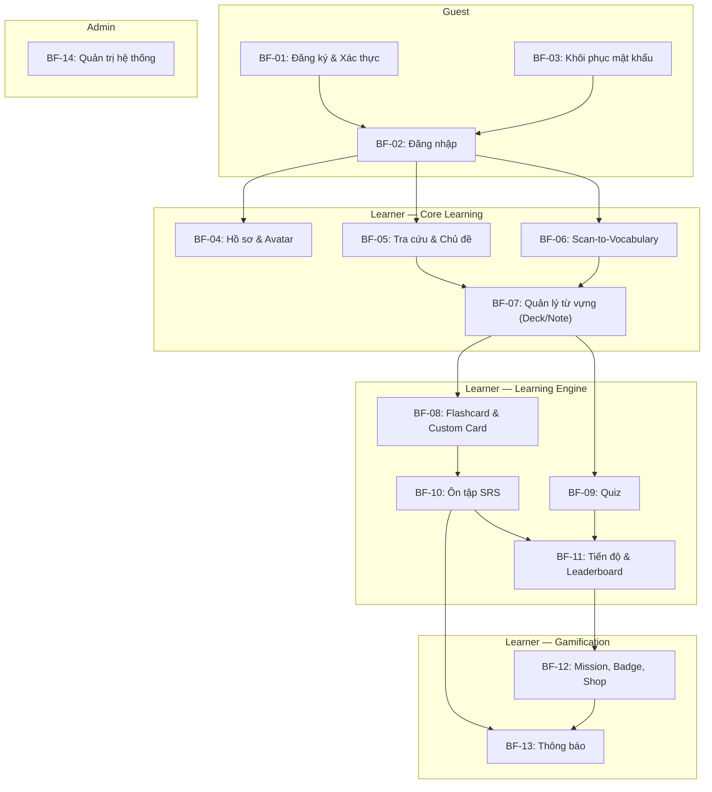

# Luồng nghiệp vụ chính — SnapVocab

> Hub: [specs.md](./specs.md) · Source of truth cho mọi FR/BF/SS/MH.  
> Tài liệu mô tả các **Business Flow (BF)** chính của hệ thống theo format: Actor, Precondition, Happy path, Alternative flow, Exception, Post-condition, Trace.  
> Quyết định canonical: xem mục "Quyết định canonical" trong specs.md §2.

**Quy ước ID:** `BF-{nn}` — mỗi BF là một luồng nghiệp vụ end-to-end, truy vết về FR trong specs.

---

## BF-01 — Đăng ký & Xác thực tài khoản

**Actor:** Guest  
**Trace:** FR-01.01, FR-01.02 · SS-03 · MH: Welcome / Register / OTP Verify  
**Milestone:** M1

### Precondition

- Guest chưa có tài khoản trong hệ thống.
- Guest đang ở màn hình Welcome/Onboarding.

### Happy Path

| Bước | Actor  | Hành động                                                                                     |
| ---- | ------ | --------------------------------------------------------------------------------------------- |
| 1    | Guest  | Mở ứng dụng, xem màn hình Welcome/Onboarding.                                                |
| 2    | Guest  | Chọn **Đăng ký**, nhập email, mật khẩu và thông tin cơ bản (tên hiển thị).                   |
| 3    | System | Validate email unique, password policy (độ dài, ký tự đặc biệt). Hash mật khẩu.              |
| 4    | System | Tạo tài khoản trạng thái `PENDING`. Sinh OTP, gửi qua email.                                 |
| 5    | Guest  | Nhập mã OTP trên màn hình xác thực.                                                          |
| 6    | System | Kiểm tra OTP đúng, chưa hết hạn (TTL ≤ 10 phút), chưa sử dụng. Chuyển tài khoản → `ACTIVE`. |
| 7    | System | Tự động đăng nhập cho Guest và chuyển vào màn hình chính.                                    |

### Alternative Flow

| Mã      | Điều kiện                         | Xử lý                                                                |
| ------- | --------------------------------- | --------------------------------------------------------------------- |
| AF-01.1 | Email đã tồn tại                  | Trả thông báo "Email đã được sử dụng", không tiết lộ chi tiết thêm.  |
| AF-01.2 | OTP hết hạn                       | Cho phép Guest yêu cầu gửi lại OTP (resend cooldown ≥ 60s).          |
| AF-01.3 | Guest nhập sai OTP nhiều lần      | Tối đa 5 lần thử. Sau 5 lần → khóa OTP hiện tại, yêu cầu tạo mới.  |
| AF-01.4 | Mật khẩu không đạt policy         | Trả lỗi cụ thể về yêu cầu mật khẩu, không tạo tài khoản.            |

### Exception

| Mã      | Lỗi                    | Xử lý                                                  |
| ------- | ----------------------- | ------------------------------------------------------- |
| EX-01.1 | Email service lỗi       | Trả thông báo "Không gửi được OTP, vui lòng thử lại."  |
| EX-01.2 | Lỗi hệ thống/database  | Trả error code chung, log chi tiết server-side.         |

### Post-condition

- Tài khoản Guest đã chuyển trạng thái `ACTIVE`.
- Guest có thể đăng nhập bằng email/password.
- OTP đã được đánh dấu đã sử dụng, không tái sử dụng.

### Business Rules

1. Mật khẩu phải hash ở backend, không lưu plaintext.
2. OTP có TTL ≤ 10 phút, tối đa 5 lần thử, resend cooldown ≥ 60s.
3. OTP không được tái sử dụng sau khi xác thực thành công.

---

## BF-02 — Đăng nhập & Quản lý phiên

**Actor:** Guest → Learner  
**Trace:** FR-01.03, FR-01.04, FR-01.06, FR-01.08 · SS-03 · MH: Login / Home  
**Milestone:** M1

### Precondition

- Guest có tài khoản trạng thái `ACTIVE`.

### Happy Path

| Bước | Actor   | Hành động                                                                              |
| ---- | ------- | -------------------------------------------------------------------------------------- |
| 1    | Guest   | Mở màn hình đăng nhập, nhập email và mật khẩu.                                        |
| 2    | System  | Xác thực credential. Nếu hợp lệ → sinh Access Token + Refresh Token.                  |
| 3    | System  | Trả token cho mobile. Guest trở thành Learner.                                         |
| 4    | Learner | Truy cập Home screen với dữ liệu cá nhân.                                             |
| 5    | System  | Khi Access Token hết hạn, mobile dùng Refresh Token để lấy Access Token mới (silent).  |
| 6    | Learner | Khi muốn đăng xuất → gọi logout. System revoke Refresh Token.                          |

### Alternative Flow

| Mã      | Điều kiện                      | Xử lý                                                                          |
| ------- | ------------------------------ | ------------------------------------------------------------------------------- |
| AF-02.1 | Sai email hoặc mật khẩu       | Trả generic message "Thông tin đăng nhập không đúng" (không tiết lộ field sai). |
| AF-02.2 | Tài khoản chưa xác thực       | Redirect sang màn hình OTP verify.                                              |
| AF-02.3 | Tài khoản bị khóa (banned)    | Thông báo "Tài khoản đã bị khóa, liên hệ hỗ trợ."                             |
| AF-02.4 | Đăng nhập bằng sinh trắc học  | Learner bật tính năng → lần sau dùng vân tay/Face ID; fallback password.        |
| AF-02.5 | Refresh Token hết hạn/revoked | Mobile xóa session local, redirect Login.                                       |

### Exception

| Mã      | Lỗi                | Xử lý                                          |
| ------- | ------------------- | ----------------------------------------------- |
| EX-02.1 | Backend unreachable | Mobile hiển thị lỗi kết nối, retry button.      |
| EX-02.2 | Token decode lỗi    | Trả 401 Unauthorized, mobile redirect Login.    |

### Post-condition

- Learner có phiên đăng nhập hợp lệ với Access Token + Refresh Token.
- Khi đăng xuất: Refresh Token bị revoke, session local bị xóa.

### Business Rules

1. Access Token dùng để gọi API; Refresh Token dùng để cấp lại Access Token.
2. Password và OTP không bao giờ được log hoặc trả về response.
3. Refresh Token bị revoke khi đăng xuất hoặc khi có rủi ro bảo mật.
4. Sai credential → trả generic message, không tiết lộ email có tồn tại hay không.

---

## BF-03 — Khôi phục mật khẩu

**Actor:** Guest  
**Trace:** FR-01.05 · SS-03 · MH: Forgot Password / Reset Password  
**Milestone:** M1

### Precondition

- Guest có tài khoản `ACTIVE` nhưng quên mật khẩu.

### Happy Path

| Bước | Actor  | Hành động                                                                                  |
| ---- | ------ | ------------------------------------------------------------------------------------------ |
| 1    | Guest  | Chọn "Quên mật khẩu" trên màn hình đăng nhập, nhập email.                                 |
| 2    | System | Kiểm tra email tồn tại. Sinh OTP/link reset, gửi qua email.                               |
| 3    | Guest  | Nhập OTP hoặc truy cập link reset.                                                         |
| 4    | System | Validate OTP/link. Cho phép nhập mật khẩu mới.                                            |
| 5    | Guest  | Nhập mật khẩu mới (phải pass policy).                                                      |
| 6    | System | Hash và cập nhật mật khẩu. Revoke tất cả phiên đăng nhập cũ. OTP invalidate.               |

### Alternative Flow

| Mã      | Điều kiện                     | Xử lý                                                                    |
| ------- | ----------------------------- | ------------------------------------------------------------------------- |
| AF-03.1 | Email không tồn tại           | Vẫn trả "OTP đã gửi" (chống enumeration), nhưng không gửi email thật.    |
| AF-03.2 | OTP sai / hết hạn             | Xử lý tương tự BF-01: tối đa 5 lần, resend cooldown.                     |
| AF-03.3 | Mật khẩu mới trùng mật khẩu cũ | Bắt buộc đổi mật khẩu khác.                                              |

### Post-condition

- Mật khẩu đã được cập nhật.
- Các phiên đăng nhập cũ đã bị revoke.
- Guest có thể đăng nhập bằng mật khẩu mới.

---

## BF-04 — Hồ sơ cá nhân & Avatar

**Actor:** Learner  
**Trace:** FR-01.07, FR-11.01, FR-11.03, FR-11.04 · SS-03, SS-16 · MH: Profile / Edit Profile  
**Milestone:** M1

### Precondition

- Learner đã đăng nhập (JWT hợp lệ).

### Happy Path

| Bước | Actor   | Hành động                                                                                  |
| ---- | ------- | ------------------------------------------------------------------------------------------ |
| 1    | Learner | Mở tab Profile, xem thông tin cá nhân hiện tại (tên, email, avatar, thống kê học tập).     |
| 2    | Learner | Chọn chỉnh sửa hồ sơ, cập nhật tên hiển thị.                                             |
| 3    | System  | Validate dữ liệu, lưu thay đổi.                                                           |
| 4    | Learner | Chọn thay đổi avatar → chụp ảnh mới hoặc chọn từ thư viện.                                |
| 5    | System  | Cấp presigned upload URL. Mobile upload ảnh trực tiếp lên Object Storage.                  |
| 6    | Mobile  | Upload hoàn tất → gọi API upload-complete.                                                 |
| 7    | System  | Validate MIME (ảnh), kích thước (≤ 5MB). Lưu metadata (object key, owner). Cập nhật user.  |
| 8    | System  | Trả avatar URL tạm thời (presigned, TTL ≤ 15 phút) cho hiển thị.                          |

### Alternative Flow

| Mã      | Điều kiện                       | Xử lý                                                |
| ------- | ------------------------------- | ----------------------------------------------------- |
| AF-04.1 | File không phải ảnh / quá lớn   | Trả lỗi validation kèm giới hạn cho phép.            |
| AF-04.2 | Upload storage lỗi              | Trả thông báo "Upload thất bại, thử lại."            |
| AF-04.3 | Learner chỉ xem, không sửa     | Hiển thị thông tin read-only kèm nút Edit.            |

### Post-condition

- Thông tin hồ sơ hoặc avatar đã được cập nhật.
- Avatar cũ (nếu có) sẽ được cleanup bởi orphan job.
- Learner chỉ xem/sửa dữ liệu cá nhân của chính mình.

### Business Rules

1. Upload media: backend sinh object key, không dùng tên file người dùng nhập.
2. Bucket private; presigned URL TTL ≤ 15 phút.
3. Backend validate loại file/kích thước ở biên hệ thống.
4. Learner chỉ truy cập dữ liệu cá nhân của chính mình.

---

## BF-05 — Tra cứu từ điển & Học theo chủ đề

**Actor:** Learner  
**Trace:** FR-03, FR-14 · SS-04, SS-05 · MH: Dictionary / Search / Topic / Word Detail  
**Milestone:** M1

### Precondition

- Learner đã đăng nhập.
- Database từ vựng đã được import (357,729+ từ).

### Happy Path — Tra cứu văn bản

| Bước | Actor   | Hành động                                                                                           |
| ---- | ------- | --------------------------------------------------------------------------------------------------- |
| 1    | Learner | Mở tab Dictionary / Search, nhập từ tiếng Anh vào ô tìm kiếm.                                     |
| 2    | System  | Tìm kiếm trong database, trả danh sách kết quả phù hợp (p95 < 500ms cho từ phổ biến).             |
| 3    | Learner | Chọn một từ từ danh sách kết quả.                                                                   |
| 4    | System  | Hiển thị Word Detail: từ tiếng Anh, nghĩa tiếng Việt, phiên âm IPA, nút phát âm, loại từ (POS).   |
| 5    | System  | Nếu từ có nhiều nghĩa/loại từ → hiển thị nhóm theo POS rõ ràng.                                    |
| 6    | Learner | (Tùy chọn) Nhấn nút **Lưu từ** → chọn Deck hoặc dùng Deck gần nhất/mặc định → tạo Note (xem BF-07). |

### Happy Path — Tra cứu giọng nói (Voice)

| Bước | Actor   | Hành động                                                                                  |
| ---- | ------- | ------------------------------------------------------------------------------------------ |
| 1    | Learner | Nhấn nút microphone, đọc từ/cụm từ tiếng Việt.                                           |
| 2    | Mobile  | Dùng native Speech-to-Text (on-device) chuyển giọng nói thành chữ tiếng Việt.             |
| 3    | System  | Tra cứu ngược (reverse-lookup) trực tiếp chữ tiếng Việt trong bảng nghĩa của database.     |
| 4    | System  | Hiển thị kết quả Word Detail (tương tự luồng văn bản).                                    |

### Happy Path — Duyệt chủ đề (Topic Learning)

| Bước | Actor   | Hành động                                                                                        |
| ---- | ------- | ------------------------------------------------------------------------------------------------ |
| 1    | Learner | Mở mục Collections, duyệt danh sách bộ sưu tập (VD: TOEIC Words, Animals).                     |
| 2    | Learner | Chọn một Collection → xem danh sách Topics (hỗ trợ phân cấp parent/child).                      |
| 3    | Learner | Chọn một Topic → xem danh sách TopicItem (từ vựng/cụm từ) kèm thuộc tính EAV.                  |
| 4    | Learner | Chọn từ cụ thể → xem chi tiết nghĩa, phiên âm, ví dụ từ TopicItemAttributeValue.               |
| 5    | Learner | (Tùy chọn) Nhấn **Lưu từ** → chọn Deck hoặc dùng Deck gần nhất/mặc định → tạo Note với `source = TOPIC`. |

### Alternative Flow

| Mã      | Điều kiện                     | Xử lý                                                        |
| ------- | ----------------------------- | ------------------------------------------------------------- |
| AF-05.1 | Từ không có trong database    | Hiển thị "Không tìm thấy từ", gợi ý kiểm tra lại chính tả.  |
| AF-05.2 | Thiếu phiên âm hoặc phát âm  | UI ghi rõ "Chưa có dữ liệu phát âm", không để trống vô nghĩa. |
| AF-05.3 | Voice-to-Text không nhận diện | Hiển thị "Không nhận diện được, vui lòng thử lại."           |
| AF-05.4 | Từ đã lưu trong Deck được chọn | Thông báo "Từ đã có trong Deck được chọn", không tạo trùng.   |
| AF-05.5 | Learner phát hiện lỗi dữ liệu | Learner chọn "Báo lỗi", nhập lý do (Nghĩa sai/Phiên âm sai...) → gửi vào Feedback Queue cho Admin. |

### Post-condition

- Learner đã xem thông tin chi tiết từ vựng.
- Nếu lưu: Note mới được tạo trong Deck được chọn với `source` phù hợp (DICT/TOPIC).

### Business Rules

1. Database từ vựng là nguồn chính cho thông tin học tập.
2. Nếu field dữ liệu thiếu → UI phân biệt rõ, không crash.
3. Lookup p95 < 500ms cho từ phổ biến (cache Redis top words khi cần).
4. Collection/Topic dùng mô hình EAV linh hoạt.

---

## BF-06 — Scan-to-Vocabulary (Nhận diện ảnh)

**Actor:** Learner  
**Trace:** FR-02, FR-11.02, FR-11.03, FR-11.04 · SS-06, SS-07 · MH: Camera / Scan Result  
**Milestone:** M2

### Precondition

- Learner đã đăng nhập.
- AI service (FastAPI + Florence-2 + SAM + CLIP) đang hoạt động.
- Hàng đợi recognition còn nhận job mới.
- Learner còn quota scan trong ngày.
- Mobile có quyền truy cập camera/thư viện.

### Happy Path

| Bước | Actor   | Hành động                                                                                                                |
| ---- | ------- | ------------------------------------------------------------------------------------------------------------------------ |
| 1    | Learner | Mở tab Camera hoặc chức năng upload ảnh.                                                                                 |
| 2    | Learner | Chụp ảnh mới bằng camera **hoặc** chọn ảnh từ thư viện thiết bị.                                                        |
| 3    | Mobile  | Validate MIME (ảnh) và kích thước (≤ 10MB) phía client.                                                                  |
| 4    | Mobile  | Gọi API cấp presigned URL và upload ảnh trực tiếp lên Object Storage.                                                                    |
| 5    | System  | Mobile gọi POST /recognition/scan (truyền objectKey). Backend kiểm tra quota scan/ngày và trả `QUOTA_EXCEEDED` nếu đã hết lượt.         |
| 6    | System  | Backend tạo `ScanRequest` (trạng thái `PENDING`), trừ lượt scan, đẩy job vào in-process queue và trả `202 Accepted` kèm `requestId`, `status = PENDING`. |
| 7    | Mobile  | Hiển thị tiến trình ("Đang tải ảnh" → "Đang nhận diện" → "Đang tra từ điển") và poll định kỳ GET /recognition/results/{requestId} (mỗi 2-3s). Có nút Hủy, cho phép rời màn hình và nhận thông báo khi xong. |
| 8    | System  | Background worker (Spring `@Async` + Bounded Executor) lấy job, đổi trạng thái thành `PROCESSING` và gọi FastAPI AI service.             |
| 9    | AI      | Pipeline xử lý: Florence-2 (OD + Dense Region + Self-grounding + Tiled OD) → lọc ngôn ngữ (WordNet + từ điển) → CLIP xác thực → SAM cắt nền. |
| 10   | AI      | Trả danh sách object: `label` (thuộc từ điển), `detectionSource`, `clipScore`, `boundingBox`, `cropUrl` (tùy chọn).                      |
| 11   | System  | Backend lọc theo cặp (source, clipScore) (cấu hình được). Gom trùng label (nhiều box cùng label → 1 từ).                     |
| 12   | System  | Ánh xạ label sang Word trong database (tra cứu trực tiếp + bảng mapping/synonym).                                      |
| 13   | System  | Cập nhật `ScanRequest = DONE` kèm danh sách từ vựng. Ở lần poll tiếp theo, mobile nhận kết quả này.                                      |
| 14   | Learner | Xem danh sách đối tượng trên màn hình kết quả. Chọn từ muốn lưu.                                                       |
| 15   | Learner | Nhấn **Lưu** → chọn Deck hoặc dùng Deck gần nhất/mặc định → tạo Note + Card với `source = SCAN` (xem BF-07).             |

### Alternative Flow

| Mã      | Điều kiện                          | Xử lý                                                                      |
| ------- | ---------------------------------- | --------------------------------------------------------------------------- |
| AF-06.1 | Ảnh không hợp lệ (MIME/size)       | Client hoặc server trả lỗi validation, gợi ý chọn ảnh khác.               |
| AF-06.2 | Không nhận diện được đối tượng     | Trả thông báo "Không nhận diện được vật thể, hãy thử ảnh rõ hơn." + CTA.  |
| AF-06.3 | Tất cả object có độ tin cậy thấp (Medium/Low) | Tương tự AF-06.2, thông báo dễ hiểu.                                     |
| AF-06.4 | Label không map được sang dictionary | Trả kết quả nhận diện, đánh dấu "Chưa có từ vựng tương ứng". Hiển thị nút "Báo từ thiếu" để đẩy nhãn từ này vào Feedback Queue cho Admin (Trace: FR-02.05, FR-13). Learner không thể lưu từ này cho đến khi Admin cập nhật từ điển. |
| AF-06.5 | Nhiều box cùng label               | Backend gom trùng label → hiển thị 1 từ duy nhất cho mỗi label.           |
| AF-06.6 | Nút nổi Android (Bubble)          | Learner dùng overlay widget chụp màn hình từ app khác → pipeline tương tự. |
| AF-06.7 | Hết quota scan trong ngày         | Backend trả `QUOTA_EXCEEDED`, `remainingScansToday = 0`, `resetAt`; mobile hiển thị lượt reset và CTA quay lại học từ đã lưu. |
| AF-06.8 | Job đang chờ hoặc đang xử lý      | Backend trả `PENDING`/`PROCESSING`; mobile hiển thị tiến trình; có nút Hủy, cho phép rời màn hình và nhận thông báo khi xong. |
| AF-06.9 | Learner phát hiện AI nhận diện sai | Learner chọn "Báo lỗi" trên object sai, chọn lý do "AI nhận diện sai" → đẩy vào Feedback Queue cho Admin. |

### Exception

| Mã      | Lỗi                                | Xử lý                                                                 |
| ------- | ----------------------------------- | ---------------------------------------------------------------------- |
| EX-06.1 | AI worker timeout (> 60s mặc định)  | Backend đặt request `FAILED`, trả error code cụ thể, mobile hiển thị "Xử lý quá lâu, thử lại." |
| EX-06.2 | AI service unavailable              | Backend giữ/hủy job theo cấu hình retry, trả lỗi nghiệp vụ thân thiện, gợi ý thử lại sau. |
| EX-06.3 | Upload storage lỗi                  | Mobile hiển thị "Upload thất bại", retry button.                       |
| EX-06.4 | Model error (invalid image input)   | AI trả error có cấu trúc, backend forward message phù hợp.           |
| EX-06.5 | Hàng đợi quá tải                    | Backend không nhận thêm job, trả `AI_QUEUE_FULL` kèm message thử lại sau; không trừ quota nếu job chưa được nhận. |

### Post-condition

- Learner đã xem danh sách từ vựng nhận diện được từ ảnh hoặc trạng thái lỗi/chờ xử lý rõ ràng.
- Hệ thống **không** tự động lưu toàn bộ kết quả — chỉ lưu khi Learner xác nhận.
- Recognition request được log: requestId, status, queue wait time, thời gian xử lý, số object, lỗi nếu có.
- App không crash ở mọi trường hợp lỗi.

### Business Rules

1. Nhãn từ AI service đã thuộc từ điển (chuỗi lọc ngôn ngữ + cổng từ điển cuối trong pipeline).
2. Backend giữ thêm điều kiện lọc bằng cặp (source allowlist, clipScore floor) cấu hình được làm lớp bảo vệ cuối.
3. Gom trùng label để tránh trả từ vựng lặp.
4. Quota mặc định 20 scan/ngày/Learner, cấu hình được; ảnh không hợp lệ hoặc hàng đợi từ chối job không trừ lượt.
5. Recognition phải xử lý qua hàng đợi FIFO hoặc ưu tiên tương đương, giới hạn worker theo GPU (mặc định 1 worker/GPU) để tránh nhiều request đồng thời vượt timeout.
6. Mobile không giữ kết nối đồng bộ; dùng `requestId` để poll kết quả với các trạng thái `PENDING`/`PROCESSING`/`DONE`/`FAILED`.
7. Không tự động lưu kết quả scan nếu Learner chưa xác nhận.
8. Ảnh scan chỉ lưu nếu cần cho lịch sử/debug, phải tuân thủ quyền riêng tư (bucket private).
9. Timeout worker→AI cấu hình được (mặc định 60s).
10. Mọi lỗi AI trả `error.code` + message, app không crash.

---

## BF-07 — Quản lý từ vựng cá nhân (Deck / Note / Card)

**Actor:** Learner  
**Trace:** FR-04, FR-05.01 · SS-08, SS-09 · MH: My Vocabulary / Deck Detail  
**Milestone:** M1 (cơ bản), M2 (từ scan)

### Precondition

- Learner đã đăng nhập.
- Learner có ít nhất 1 Deck (hệ thống luôn tạo Deck mặc định khi đăng ký).

### Happy Path — Lưu từ mới

| Bước | Actor   | Hành động                                                                                                      |
| ---- | ------- | -------------------------------------------------------------------------------------------------------------- |
| 1    | Learner | Từ Word Detail (BF-05) hoặc Scan Result (BF-06), nhấn **Lưu từ**/**Lưu tất cả**.                              |
| 2    | System  | Xác định Deck đích: dùng Deck gần nhất (hoặc Deck mặc định). Lưu ngay lập tức và hiển thị thông báo (toast) cho phép Learner nhấn **Đổi Deck** nếu muốn thay đổi. |
| 3    | System  | Kiểm tra Note trùng trong Deck đích (unique per Deck rule).                                                    |
| 4    | System  | Tạo Note mới liên kết Word, gắn `source` (SCAN / DICT / TOPIC). Tạo kèm NoteMeaning, NotePronunciation.      |
| 5    | System  | Tự động sinh 1 Card cho Note. Card ở trạng thái `NEW` với tham số SRS khởi tạo. *(M1: Deck mặc định render theo CLASSIC hard-code; entity CardTemplate đầy đủ từ M3)* |
| 6    | System  | Trả xác nhận "Đã lưu vào <Deck name>" kèm action "Đổi Deck" khi còn ở màn kết quả/chi tiết.                 |

### Happy Path — Xem & Quản lý danh sách

| Bước | Actor   | Hành động                                                                                        |
| ---- | ------- | ------------------------------------------------------------------------------------------------ |
| 1    | Learner | Mở My Vocabulary → xem danh sách Note trong Deck.                                               |
| 2    | Learner | Lọc theo UI state (new, learning, reviewing, mastered), ngày lưu, độ khó, ngày ôn tiếp theo.    |
| 3    | Learner | Xem chi tiết một Note: từ, nghĩa, phiên âm, source, trạng thái Card/SRS.                       |
| 4    | Learner | (Tùy chọn) Sửa Note qua Edit bottom-sheet (đổi nghĩa, thêm ví dụ, ghi chú cá nhân).           |
| 5    | Learner | (Tùy chọn) Xóa/archive Note.                                                                    |
| 6    | System  | Khi xóa/archive Note: Card gắn Note được ẩn/archive. Word dictionary gốc **không** bị xóa.     |

### Alternative Flow

| Mã      | Điều kiện                           | Xử lý                                                         |
| ------- | ----------------------------------- | -------------------------------------------------------------- |
| AF-07.1 | Note trùng trong cùng Deck          | Thông báo "Từ đã có trong Deck này", không tạo trùng.         |
| AF-07.2 | Deck chưa có CardTemplate           | Gán System Template mặc định (CLASSIC).                        |
| AF-07.3 | Learner chưa có Note nào            | Hiển thị empty state + CTA "Tra cứu / Scan để thêm từ mới".  |

### Post-condition

- Note/Card mới đã được tạo trong Deck đích đã xác nhận.
- Từ đã sẵn sàng cho Flashcard, Quiz, SRS.
- Xóa/archive Note không ảnh hưởng Word dictionary gốc.

### Business Rules

1. **Canonical model:** `Deck` → `Note` → `Card`. UI "My Vocabulary" = danh sách Note.
2. **Không** tạo entity `SavedWord`/`UserWord` song song.
3. Unique per Deck: 1 Learner không có Note trùng cùng Word trong cùng Deck.
4. Luồng Save từ mọi nguồn (DICT/TOPIC/SCAN) dùng chung 1 pattern UX: Lưu ngay lập tức vào Deck gần nhất (hoặc Deck mặc định), kèm thông báo (toast) cung cấp tùy chọn "Đổi Deck".
5. Note/Card là nguồn đầu vào chính cho Flashcard, Quiz, SRS.

---

## BF-08 — Học Flashcard & Custom Card

**Actor:** Learner  
**Trace:** FR-05 · SS-09 · MH: Flashcard / Study Session  
**Milestone:** M1 (flip CLASSIC hard-code + FSRS 4 mức Again/Hard/Good/Easy), M3 (CardTemplate entity đầy đủ + multi-template + custom template)

### Precondition

- Learner có ít nhất 1 Card trong Deck (từ Note đã lưu).
- Deck đã được gán template render. *(M1: layout CLASSIC hard-code; M3: CardTemplate entity với UI cấu hình)*

### Happy Path

| Bước | Actor   | Hành động                                                                                           |
| ---- | ------- | --------------------------------------------------------------------------------------------------- |
| 1    | Learner | Mở Deck → chọn **Học Flashcard** hoặc chọn **Flashcard** từ Home (chế độ học gộp toàn bộ Deck). |
| 2    | System  | Lấy danh sách Card cần học (new + due). Render giao diện thẻ theo template của Deck. *(M1: layout CLASSIC hard-code trong mobile; M3: render theo CardTemplateField config từ API)* |
| 3    | Learner | Xem mặt trước (Front) của thẻ: từ tiếng Anh, ảnh crop (nếu có), audio (nếu có).                   |
| 4    | Learner | Tương tác: lật thẻ (Flip), gõ từ (Type-in), nghe audio (Listening) — tùy loại template.            |
| 5    | System  | Hiển thị mặt sau (Back): nghĩa tiếng Việt, phiên âm, ví dụ.                                       |
| 6    | Learner | Đánh giá mức độ nhớ theo FSRS (Again, Hard, Good, Easy).                                           |
| 7    | System  | Ghi ReviewLog (rating, thời gian). Cập nhật tham số SRS trên Card (state, dueAt, stability, difficulty). |
| 8    | System  | Chuyển sang Card tiếp theo. Lặp lại bước 3–7.                                                      |
| 9    | System  | Khi hết Card → hiển thị summary phiên học (số thẻ, accuracy).                                      |

### Alternative Flow

| Mã      | Điều kiện                         | Xử lý                                                                       |
| ------- | --------------------------------- | ---------------------------------------------------------------------------- |
| AF-08.1 | Deck không có Card                | Empty state + CTA "Lưu thêm từ để bắt đầu học."                            |
| AF-08.2 | Thay đổi Template cho Deck       | Card cũ không mất, chỉ thay đổi cách render. SRS giữ nguyên.               |
| AF-08.5 | Học gộp từ Home (Global Session) | Lấy Card từ tất cả các Deck. Mỗi thẻ tự động render theo template của Deck chứa nó. Header hiển thị tên Deck hiện tại để user có ngữ cảnh. |
| AF-08.3 | Từ thiếu audio/IPA               | Flashcard vẫn hoạt động, tự động ẩn field tương ứng, không lỗi layout.      |
| AF-08.4 | Learner tạo Custom Template      | Learner tự cấu hình layout, field mapping, kiểu tương tác → gán cho Deck.  |

### Post-condition

- ReviewLog đã được ghi cho mỗi Card.
- Tham số SRS trên Card đã cập nhật → ảnh hưởng review queue.
- Progress (FR-08) được cập nhật.

### Business Rules

1. System template không thể sửa/xóa; Custom template xóa mềm (soft-delete).
2. 1 Note → 1 Card theo template Deck.
3. Khi đổi Template: Card cũ giữ nguyên SRS, chỉ thay render.
4. Field thiếu dữ liệu → ẩn, không crash layout.

---

## BF-09 — Quiz & Kiểm tra

**Actor:** Learner  
**Trace:** FR-06 · SS-10 · MH: Quiz / Quiz Result  
**Milestone:** M3

### Precondition

- Learner có đủ Note/Card trong Deck để sinh quiz (hệ thống cần số lượng tối thiểu cho đáp án nhiễu).

### Happy Path

| Bước | Actor   | Hành động                                                                                           |
| ---- | ------- | --------------------------------------------------------------------------------------------------- |
| 1    | Learner | Mở Quiz từ Deck hoặc từ Home. Chọn loại quiz (multiple choice, matching, fill blank).               |
| 2    | System  | Sinh bộ câu hỏi từ Note/Card. Tạo đáp án đúng + đáp án nhiễu (lấy cùng Deck/POS, không trùng).    |
| 3    | Learner | Trả lời từng câu hỏi.                                                                               |
| 4    | System  | Sau mỗi câu: phản hồi đúng/sai (tuỳ mode). Sau quiz: tính điểm, tỷ lệ chính xác.                 |
| 5    | System  | Lưu QuizAttempt: điểm, số câu đúng/sai, thời gian làm, timestamp.                                 |
| 6    | System  | Cập nhật Progress (XP, accuracy). Kiểm tra Mission nếu M4 bật.                                      |

### Alternative Flow

| Mã      | Điều kiện                        | Xử lý                                                                   |
| ------- | -------------------------------- | ------------------------------------------------------------------------ |
| AF-09.1 | Số Note chưa đủ sinh quiz        | Hiển thị CTA "Lưu thêm từ trước khi tạo quiz."                         |
| AF-09.2 | Learner thoát giữa chừng         | Hệ thống hiển thị popup xác nhận. Nếu đồng ý, hủy toàn bộ kết quả hiện tại (không lưu draft) và thoát phiên quiz. |
| AF-09.3 | Retry quiz (cùng attempt)        | Idempotent submit — retry không cộng trùng điểm/XP (dùng event key).    |
| AF-09.4 | Ôn từ sai                        | Khởi tạo phiên xem-lại thuần túy (chỉ chứa các từ sai). Phiên này KHÔNG ghi ReviewLog, KHÔNG cập nhật trạng thái FSRS của thẻ (tuân thủ BR-3). |

### Exception

| Mã      | Lỗi              | Xử lý                                        |
| ------- | ----------------- | --------------------------------------------- |
| EX-09.1 | API lỗi khi submit | Trả error code, mobile giữ answer local để retry. |

### Post-condition

- QuizAttempt đã được ghi nhận.
- Progress, XP, accuracy được cập nhật.
- Kết quả quiz không cập nhật thông số FSRS (chỉ ghi nhận QuizAttempt, progress, XP).

### Business Rules

1. Đáp án nhiễu lấy từ Note cùng Deck/POS, không trùng nghĩa.
2. Submit quiz idempotent (event key, retry không cộng trùng).
3. Kết quả quiz không cập nhật thông số FSRS (chỉ ghi nhận QuizAttempt, progress, XP).
4. Yêu cầu số Note tối thiểu để sinh quiz.

---

## BF-10 — Ôn tập SRS (Spaced Repetition System)

**Actor:** Learner  
**Trace:** FR-07, FR-10.01 · SS-11, SS-15 · MH: Review / Home (due count)  
**Milestone:** M3

### Precondition

- Learner có Card với `dueAt ≤ now` (đến hạn ôn tập).

### Happy Path

| Bước | Actor   | Hành động                                                                                             |
| ---- | ------- | ----------------------------------------------------------------------------------------------------- |
| 1    | System  | Tính Daily Review Queue: lấy tất cả Card của Learner có `dueAt ≤ now`, ưu tiên overdue trước.        |
| 2    | System  | (Push Notification) Nếu Learner bật nhận thông báo → gửi push nhắc nhở ôn tập SRS.                  |
| 3    | Learner | Mở app → Home hiển thị số từ cần ôn hôm nay. Nhấn vào để bắt đầu phiên ôn.                          |
| 4    | System  | Hiển thị Card theo flashcard template (mỗi Card tự động render theo template của Deck chứa nó, Header ghi rõ tên Deck). |
| 5    | Learner | Xem thẻ → đánh giá mức nhớ FSRS (Again, Hard, Good, Easy).                                           |
| 6    | System  | Ghi ReviewLog. Cập nhật Card: state, dueAt, stability, difficulty theo FSRS.                         |
| 7    | System  | **Recall tốt** → tăng khoảng cách ôn (interval dài hơn). **Recall kém** → giảm hoặc đưa về LEARNING/RELEARNING theo FSRS. |
| 8    | System  | Chuyển Card tiếp. Lặp đến hết queue → hiển thị summary.                                              |
| 9    | System  | Cập nhật Progress (số lượt ôn, streak, accuracy).                                                     |

### Alternative Flow

| Mã      | Điều kiện                       | Xử lý                                                                  |
| ------- | ------------------------------- | ----------------------------------------------------------------------- |
| AF-10.1 | Không có Card đến hạn           | Home hiển thị "Bạn đã ôn xong hôm nay! 🎉" hoặc số due = 0.           |
| AF-10.2 | Card quá hạn ôn (overdue)       | Ưu tiên trong review queue trước các Card vừa đến hạn.                 |
| AF-10.3 | Learner muốn reset lịch học     | Cho phép reset Card về trạng thái NEW hoặc archive.                    |
| AF-10.4 | Learner bỏ giữa chừng          | Card chưa review giữ nguyên trong queue cho lần sau.                   |

### Post-condition

- Card đã ôn có `dueAt` mới theo FSRS.
- ReviewLog đã được ghi.
- Streak tăng nếu Learner hoàn thành điều kiện học tối thiểu trong ngày.

### Business Rules

1. FSRS trên `Card`: state/dueAt/stability/difficulty.
2. Review queue chỉ gồm Card thuộc Deck/Note của Learner hiện tại.
3. Recall tốt → interval tăng; recall kém → interval giảm hoặc đưa về LEARNING/RELEARNING theo FSRS.
4. Từ mới → trạng thái học ban đầu, lịch ôn đầu tiên.
5. Overdue card được ưu tiên trong queue.

---

## BF-11 — Tiến độ học tập & Leaderboard

**Actor:** Learner  
**Trace:** FR-08, FR-09.01, FR-09.02, FR-09.05 · SS-12, SS-13 · MH: Home / Progress / Leaderboard  
**Milestone:** M3 (Progress), M4 (Leaderboard)

### Precondition

- Learner đã thực hiện ít nhất một hoạt động học (lưu từ, flashcard, quiz, review).

### Happy Path — Xem tiến độ

| Bước | Actor   | Hành động                                                                                              |
| ---- | ------- | ------------------------------------------------------------------------------------------------------ |
| 1    | Learner | Mở Home screen → xem progress summary widget: số từ đã lưu, đã học, đang ôn, mastered theo learning-state map. |
| 2    | Learner | Mở màn hình Progress chi tiết.                                                                         |
| 3    | System  | Hiển thị: streak (chuỗi ngày liên tiếp), accuracy (quiz/review), lịch sử hoạt động ngày/tuần/tháng.  |
| 4    | System  | Tổng hợp dữ liệu từ ReviewLog, QuizAttempt, Note count.                                               |

### Happy Path — Leaderboard

| Bước | Actor   | Hành động                                                                                |
| ---- | ------- | ---------------------------------------------------------------------------------------- |
| 1    | Learner | Mở tab Leaderboard → xem xếp hạng theo XP / streak / điểm học tập.                     |
| 2    | System  | Lấy leaderboard từ Redis sorted set / snapshot cache. Hiển thị top N + vị trí Learner.  |

### Post-condition

- Learner đã xem tiến độ cập nhật.
- Leaderboard phản ánh XP/activity theo rule.

### Business Rules

1. Progress cập nhật sau các hoạt động: lưu từ, flashcard, review, quiz.
2. Streak rule: Điều kiện duy trì là ≥ 1 lượt review SRS HOẶC ≥ 1 lượt submit Quiz hoàn thành trước 24:00 GMT+7 mỗi ngày. Hệ thống MVP không có tính năng bảo vệ chuỗi (Streak Freeze).
3. Leaderboard dùng Redis/cache, không full-scan aggregate mỗi request.
4. Dữ liệu progress cá nhân không công khai, ngoại trừ thông tin hiển thị trên Leaderboard (`displayName`, `avatar`, `Weekly XP`).

---

## BF-12 — Gamification (Mission, Badge, XP, Coin, Shop)

**Actor:** Learner  
**Trace:** FR-09.03, FR-09.04, FR-09.06, FR-09.07 · SS-13, SS-14 · MH: Missions / Badge / Shop  
**Milestone:** M4

### Precondition

- Module gamification đã bật (M4).
- Admin đã cấu hình Missions, Badges, Shop Items.

### Happy Path — Nhiệm vụ & Phần thưởng

| Bước | Actor   | Hành động                                                                                                    |
| ---- | ------- | ------------------------------------------------------------------------------------------------------------ |
| 1    | Learner | Mở màn hình Missions → xem danh sách nhiệm vụ ngày/tuần/thành tựu.                                        |
| 2    | System  | Hiển thị tiến độ từng nhiệm vụ (VD: "Ôn 10 từ hôm nay: 7/10").                                             |
| 3    | Learner | Hoàn thành hoạt động học → hệ thống tự động cập nhật MissionProgress.                                       |
| 4    | System  | Khi mission hoàn thành → trao reward: XP, Coin, Badge (theo rule). Ghi ExperienceLog, CoinTransaction.     |
| 5    | System  | Gửi In-app Notification "Bạn đã hoàn thành nhiệm vụ X, nhận Y coin!"                                      |

### Happy Path — Cửa hàng vật phẩm

| Bước | Actor   | Hành động                                                                                          |
| ---- | ------- | -------------------------------------------------------------------------------------------------- |
| 1    | Learner | Mở Shop → duyệt danh sách vật phẩm (theme, avatar frame, booster).                               |
| 2    | Learner | Chọn mua vật phẩm bằng Coin.                                                                      |
| 3    | System  | Kiểm tra balance Coin ≥ giá. Trừ coin (CoinTransaction). Tạo UserItem.                           |
| 4    | Learner | Áp dụng vật phẩm (VD: đổi theme, đổi avatar frame).                                              |

### Happy Path — Huy hiệu

| Bước | Actor   | Hành động                                                                                |
| ---- | ------- | ---------------------------------------------------------------------------------------- |
| 1    | System  | Khi Learner đạt điều kiện cụ thể (VD: streak 30 ngày, 100 lượt scan có lưu từ) → trao Badge.      |
| 2    | System  | Tạo UserBadge. Gửi In-app Notification.                                                  |
| 3    | Learner | Xem danh sách Badge đã đạt trong Profile / Badge Gallery.                                |

### Alternative Flow

| Mã      | Điều kiện                        | Xử lý                                                              |
| ------- | -------------------------------- | ------------------------------------------------------------------- |
| AF-12.1 | Coin không đủ mua vật phẩm      | Hiển thị "Bạn không đủ Coin", gợi ý hoàn thành nhiệm vụ.          |
| AF-12.2 | Mission đã hoàn thành            | Trạng thái COMPLETED, không claim lại. Chờ reset (daily/weekly).   |
| AF-12.3 | Retry claim reward               | Idempotent — event key đảm bảo không cộng trùng XP/Coin.          |

### Post-condition

- XP/Coin đã được cập nhật theo rule.
- Badge/UserItem đã được ghi nhận.
- CoinTransaction và ExperienceLog đã được log.

### Business Rules

1. Reward có rule rõ ràng, idempotent (event key, retry không cộng trùng).
2. Coin chỉ là đơn vị trong ứng dụng, không quy đổi tiền thật.
3. Balance Coin ≥ 0 tại mọi thời điểm.

---

## BF-13 — Thông báo hệ thống (Notification)

**Actor:** Learner  
**Trace:** FR-10 · SS-15 · MH: Notification / Settings  
**Milestone:** M3

### Precondition

- Learner đã đăng nhập.

### Happy Path — Xin quyền Notification

| Bước | Actor   | Hành động                                                                                               |
| ---- | ------- | ------------------------------------------------------------------------------------------------------- |
| 1    | System  | Sau khi Learner hoàn thành phiên ôn tập (review) đầu tiên, hiển thị popup xin quyền gửi Push Notification cấp hệ điều hành. |
| 2    | Learner | Chọn "Cho phép" trên prompt của OS (Android 13+ / iOS).                                                 |
| 3    | Mobile  | Đăng ký Device Token với Expo Push / Firebase FCM, gọi API lưu token lên backend.                       |

### Happy Path

| Bước | Actor   | Hành động                                                                                               |
| ---- | ------- | ------------------------------------------------------------------------------------------------------- |
| 1    | System  | Khi có sự kiện cần thông báo (SRS due, Streak at risk lúc 20h, Badge mới, Mission hoàn thành):                                 |
| 2    | System  | **Push Notification:** Gửi qua Expo Push / Firebase FCM nếu Learner bật nhận thông báo.                |
| 3    | System  | **In-app Notification:** Lưu vào database để Learner xem lại khi mở app.                               |
| 4    | Learner | Mở app → xem danh sách In-app Notification. Đánh dấu đã đọc.                                          |
| 5    | Learner | Vào Settings → bật/tắt nhận Push Notification.                                                          |

### Alternative Flow

| Mã      | Điều kiện                        | Xử lý                                              |
| ------- | -------------------------------- | --------------------------------------------------- |
| AF-13.1 | Learner tắt notification        | Không gửi push, vẫn lưu in-app.                    |
| AF-13.2 | Device token hết hạn / thay đổi | Mobile đăng ký lại token khi mở app.               |
| AF-13.3 | Nguy cơ đứt chuỗi (Streak at risk) | Nếu user có streak > 0 nhưng chưa học tính đến 20:00, đẩy push notification cảnh báo sắp mất chuỗi. |
| AF-13.4 | Learner từ chối quyền cấp OS    | Không lấy được token. Trong app Settings hiển thị banner "Thông báo đang tắt ở cấp hệ thống", nút toggle sẽ mở OS Settings. |

### Business Rules

1. Push Notification qua Expo Push hoặc Firebase FCM.
2. In-app Notification lưu database để Learner xem lại.
3. Tối đa 1 push nhắc học/ngày (nhắc ôn tập SRS hoặc "Streak at risk") trong khung 19–20h; tuân thủ cấu hình giờ nhận (nếu có).
4. Learner có thể bật/tắt push trong Settings.

---

## BF-14 — Quản trị hệ thống (Admin)

**Actor:** Admin  
**Trace:** FR-13 · SS-17 · MH: CMS Dashboard  
**Milestone:** M4 (có thể parallel)

### Precondition

- Admin đã đăng nhập với role `ROLE_ADMIN`.
- CMS/Dashboard chạy độc lập với Mobile App.

### Happy Path — Quản lý người dùng

| Bước | Actor | Hành động                                                                                  |
| ---- | ----- | ------------------------------------------------------------------------------------------ |
| 1    | Admin | Mở CMS → User Management. Xem danh sách user, tìm kiếm.                                  |
| 2    | Admin | Xem chi tiết user: thông tin cá nhân, tiến độ học tập.                                     |
| 3    | Admin | Ban/Unban tài khoản hoặc Reset mật khẩu cho Learner.                                      |

### Happy Path — Quản lý từ điển & chủ đề

| Bước | Actor | Hành động                                                                                          |
| ---- | ----- | -------------------------------------------------------------------------------------------------- |
| 1    | Admin | Mở CMS → Dictionary Management. CRUD từ vựng, định nghĩa, phiên âm.                              |
| 2    | Admin | Quản lý cấu trúc Collection/Topic.                                                                 |
| 3    | Admin | Import từ vựng hàng loạt qua CSV/Excel.                                                            |
| 4    | Admin | Duyệt các từ bị Learner báo lỗi (Feedback queue).                                                 |

### Happy Path — Quản lý Gamification & Template

| Bước | Actor | Hành động                                                                            |
| ---- | ----- | ------------------------------------------------------------------------------------ |
| 1    | Admin | *(Phạm vi MVP/M4)* Cấu hình Missions, Badges, XP, vật phẩm Shop thông qua DB/Script/API (chưa xây dựng UI cấu hình phức tạp trên CMS). |
| 2    | Admin | *(Phạm vi MVP/M4)* Quản lý System Card Template thông qua DB/Script/API. |

### Happy Path — Thống kê

| Bước | Actor | Hành động                                                                                           |
| ---- | ----- | --------------------------------------------------------------------------------------------------- |
| 1    | Admin | Mở Stats Dashboard → xem biểu đồ: người dùng active, lượt dùng AI, dung lượng R2/S3, tổng quan.  |

### Business Rules

1. Tất cả API quản trị yêu cầu `ROLE_ADMIN`.
2. CMS chạy độc lập, không nằm trong mobile app.
3. Xóa từ vựng: soft-delete để không hỏng Note/Card của Learner.
4. Admin không can thiệp vào tiến độ học tập cá nhân cụ thể của Learner.

---

## Tổng quan mapping BF → FR → Milestone

| BF    | Tên luồng                   | FR chính          | Milestone |
| ----- | ---------------------------- | ----------------- | --------- |
| BF-01 | Đăng ký & Xác thực          | FR-01.01, FR-01.02 | M1        |
| BF-02 | Đăng nhập & Quản lý phiên   | FR-01.03, 04, 06, 08 | M1        |
| BF-03 | Khôi phục mật khẩu          | FR-01.05           | M1        |
| BF-04 | Hồ sơ & Avatar              | FR-01.07, FR-11    | M1        |
| BF-05 | Tra cứu từ điển & Chủ đề    | FR-03, FR-04.01    | M1        |
| BF-06 | Scan-to-Vocabulary           | FR-02, FR-11       | M2        |
| BF-07 | Quản lý từ vựng cá nhân     | FR-04, FR-05.01    | M1–M2     |
| BF-08 | Học Flashcard & Custom Card  | FR-05              | M1, M3    |
| BF-09 | Quiz & Kiểm tra             | FR-06              | M3        |
| BF-10 | Ôn tập SRS                  | FR-07, FR-10.01    | M3        |
| BF-11 | Tiến độ & Leaderboard       | FR-08, FR-09       | M3–M4     |
| BF-12 | Gamification                 | FR-09.03–07        | M4        |
| BF-13 | Thông báo                   | FR-10              | M3        |
| BF-14 | Quản trị hệ thống           | FR-13              | M4        |

---

## Sơ đồ tổng quan luồng nghiệp vụ chính

---

## Checklist tài liệu

- [x] Mỗi BF có: Actor, Precondition, Happy Path, Alternative Flow, Exception (khi cần), Post-condition, Business Rules.
- [x] BF truy vết về FR trong [specs.md](./specs.md).
- [x] Actor đúng theo canonical: Guest, Learner, Admin.
- [x] Canonical model: Deck → Note → Card + ReviewLog (không `SavedWord`/`UserWord`).
- [x] AI pipeline: Florence-2 + SAM + CLIP (không YOLO).
- [x] SRS: FSRS trên Card.
- [x] Milestone mapping M1–M4.
- [x] FR IDs khớp specs (Game=FR-09, Noti=FR-10, Storage=FR-11, OpenAPI=FR-12, Admin=FR-13).
