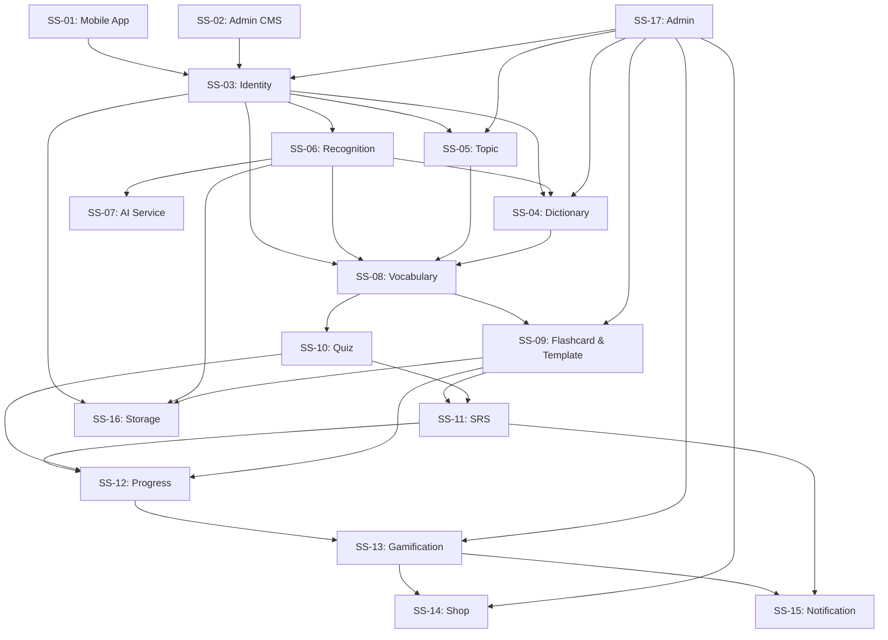

# Phân Rã Phân Hệ Hệ Thống — SnapVocab

> Hub: [specs.md](./specs.md) · Source of truth cho mọi FR/BF/SS/MH.  
> Tài liệu mô tả cách hệ thống SnapVocab được phân rã thành các phân hệ (module/subsystem), trách nhiệm, entities, API chính và quan hệ phụ thuộc giữa chúng.  
> Quyết định canonical: xem bảng §66–76 trong specs.md.

**Quy ước ID:** `SS-{nn}` — mỗi SS là một phân hệ/module trong kiến trúc backend hoặc hệ thống.
**Quy ước Endpoint (REST API Naming Convention):** Tất cả các public API đều ngầm định có **Base Path là `/api/v1`**. Luôn sử dụng danh từ số nhiều (plural nouns) và gom nhóm theo prefix (VD: `/api/v1/quizzes`, `/api/v1/reviews`). Tài liệu này là Single Source of Truth cho toàn bộ URL của hệ thống.

---

## Tổng quan phân hệ

Hệ thống SnapVocab được chia thành **18 phân hệ** thuộc 5 lớp chức năng:

```text
┌──────────────────────────────────────────────────────────────────────────────────────────┐
│                                   HỆ THỐNG SNAPVOCAB                                     │
│                                                                                          │
│  ═══════════════════════ LỚP PRESENTATION (Client) ══════════════════════════            │
│  ┌────────────────────────┐  ┌────────────────────────┐                                  │
│  │  SS-01: MOBILE APP     │  │  SS-02: ADMIN CMS      │                                  │
│  │  (React Native/Expo)   │  │  (Web App Dashboard)   │                                  │
│  └────────────┬───────────┘  └────────────┬───────────┘                                  │
│               │                            │                                              │
│  ═══════════════════════ LỚP IDENTITY & SECURITY ════════════════════════════            │
│  ┌────────────────────────────────────────────────────────┐                               │
│  │  SS-03: IDENTITY (Auth, User, Profile, JWT, OTP)       │                               │
│  └────────────────────────┬───────────────────────────────┘                               │
│                            │                                                              │
│  ═══════════════════════ LỚP DOMAIN CHÍNH ═══════════════════════════════════            │
│  ┌──────────────┐  ┌──────────────┐  ┌──────────────┐  ┌──────────────────┐              │
│  │  SS-04:      │  │  SS-05:      │  │  SS-06:      │  │  SS-07:          │              │
│  │  DICTIONARY  │  │  TOPIC       │  │  RECOGNITION │  │  AI SERVICE      │              │
│  │  (Từ điển)   │  │  (Chủ đề)    │  │  (Orchestr.) │  │  (Florence-2)    │              │
│  └──────┬───────┘  └──────┬───────┘  └──────┬───────┘  └──────────────────┘              │
│         │                 │                  │                                            │
│  ┌──────┴─────────────────┴──────────────────┴────────────────────────────┐               │
│  │  SS-08: VOCABULARY (Deck / Note / Card — Personal Vocabulary)          │               │
│  └───────────────────────────┬────────────────────────────────────────────┘               │
│                               │                                                          │
│  ═══════════════════════ LỚP LEARNING ENGINE ════════════════════════════════            │
│  ┌──────────────┐  ┌──────────────┐  ┌──────────────┐  ┌──────────────────┐              │
│  │  SS-09:      │  │  SS-10:      │  │  SS-11:      │  │  SS-12:          │              │
│  │  FLASHCARD   │  │  QUIZ        │  │  SRS         │  │  PROGRESS        │              │
│  │  & TEMPLATE  │  │              │  │  (FSRS)      │  │  TRACKING        │              │
│  └──────────────┘  └──────────────┘  └──────────────┘  └──────────────────┘              │
│                                                                                          │
│  ═══════════════════════ LỚP ENGAGEMENT & INFRA ═════════════════════════════            │
│  ┌──────────────┐  ┌──────────────┐  ┌──────────────┐  ┌──────────────────┐              │
│  │  SS-13:      │  │  SS-14:      │  │  SS-15:      │  │  SS-16:          │              │
│  │  GAMIFICATION│  │  SHOP        │  │  NOTIFICATION│  │  STORAGE         │              │
│  │  (XP,Coin,   │  │  (Vật phẩm)  │  │  (Push/      │  │  (Object         │              │
│  │  Badge,      │  │              │  │   In-app)    │  │   Storage)       │              │
│  │  Mission)    │  │              │  │              │  │                  │              │
│  └──────────────┘  └──────────────┘  └──────────────┘  └──────────────────┘              │
│                                                                                          │
│  ┌──────────────┐  ┌──────────────┐                                                      │
│  │  SS-17:      │  │  SS-18:      │                                                      │
│  │  ADMIN       │  │  API DOCS    │                                                      │
│  │  (Dashboard) │  │  (OpenAPI)   │                                                      │
│  └──────────────┘  └──────────────┘                                                      │
└──────────────────────────────────────────────────────────────────────────────────────────┘
```

---

## SS-01: Mobile App — Ứng dụng di động

### Mô tả

Giao diện người dùng chính của hệ thống. Cung cấp trải nghiệm học từ vựng trên thiết bị di động: camera/gallery, tra cứu từ điển, flashcard, quiz, SRS, gamification và quản lý hồ sơ cá nhân.

### Công nghệ

| Thành phần       | Công nghệ                          |
| ---------------- | ---------------------------------- |
| Framework        | React Native / Expo                |
| Ngôn ngữ         | TypeScript                         |
| Navigation       | Expo Router                        |
| State management | Tùy chọn (Context / Zustand / TQ)  |
| API Client       | Axios / Fetch + interceptor JWT    |

### Chức năng chính

- Màn hình Welcome/Onboarding, đăng ký, đăng nhập, OTP verify
- Hồ sơ cá nhân, avatar upload
- Camera capture, gallery pick, gửi ảnh nhận diện
- Nút nổi quét màn hình (Android overlay bubble — Could)
- Tra cứu từ điển (text + voice), duyệt Collection/Topic
- My Vocabulary (Deck/Note list), word detail
- Flashcard study session, render theo CardTemplate config
- Quiz (MCQ, matching, fill blank)
- SRS review session, FSRS rating
- Progress dashboard, streak, accuracy
- Leaderboard, missions, badges, shop
- Thông báo in-app, cấu hình push notification
- Settings

### Trace

- FR: FR-01 → FR-12 (consumer)
- BF: BF-01 → BF-13

### Milestone

- M1: Auth, Profile, Dictionary, Topic, Vocab, Flashcard cơ bản
- M2: Camera/Scan, Scan result
- M3: Quiz, SRS, Progress, Notification
- M4: Gamification, Leaderboard, Shop

---

## SS-02: Admin CMS — Dashboard quản trị

### Mô tả

Web application nội bộ (tách biệt với Mobile App) dành cho Admin quản lý người dùng, từ vựng, chủ đề, gamification, card template và xem thống kê hệ thống.

### Công nghệ

| Thành phần | Công nghệ          |
| ---------- | ------------------- |
| Platform   | Web App nội bộ      |
| Auth       | JWT (role ROLE_ADMIN) |

### Chức năng chính

- Quản lý người dùng: list, search, ban/unban, reset password
- Quản lý từ điển: CRUD Word/Definition/Translation/Pronunciation, soft-delete
- Quản lý Collection/Topic: cấu trúc chủ đề, TopicItem, thuộc tính EAV
- Import dữ liệu từ vựng hàng loạt (CSV/Excel)
- Quản lý System Card Template
- Quản lý gamification: Missions, Badges, Shop Items, XP config
- Xem Feedback/báo lỗi từ người dùng
- Dashboard thống kê: users active, lượt dùng AI, dung lượng R2/S3

### Trace

- FR: FR-13
- BF: BF-14

### Milestone

- M4 (có thể parallel, không block M1–M3)

---

## SS-03: Identity — Xác thực & Quản lý người dùng

### Mô tả

Quản lý toàn bộ vòng đời tài khoản: đăng ký, xác thực email/OTP, đăng nhập (mật khẩu + sinh trắc học), quản lý phiên JWT, khôi phục mật khẩu và hồ sơ cá nhân. Cung cấp identity context cho tất cả phân hệ khác.

### Entities

| Entity         | Mô tả                                                                       |
| -------------- | ---------------------------------------------------------------------------- |
| `User`         | Tài khoản người dùng (name, email, hashedPassword, avatarUrl, status, role)  |
| `Authority`    | Quyền/vai trò: ROLE_LEARNER, ROLE_ADMIN                                     |
| `RefreshToken` | Token làm mới phiên đăng nhập (token, userId, expiresAt, revoked)            |
| `OtpToken`     | Mã OTP xác thực (code, userId, type, expiresAt, used, attemptCount)          |

### Chức năng chính

- Đăng ký tài khoản (email, password, tên hiển thị)
- Xác thực email/OTP (TTL ≤ 10 phút, max 5 lần, resend ≥ 60s, one-time)
- Đăng nhập (email/password → Access Token + Refresh Token)
- Đăng nhập vân tay/sinh trắc học (Should)
- Refresh token (rotate, revoke on logout)
- Đăng xuất (revoke refresh token)
- Khôi phục mật khẩu (OTP/link reset)
- Xem/cập nhật hồ sơ cá nhân (tên, avatar)
- Cung cấp user identity + role cho Spring Security filter chain

### API Endpoints

| Method | Endpoint                    | Mô tả                                    | Auth     |
| ------ | --------------------------- | ----------------------------------------- | -------- |
| GET    | `/app-config`               | Cấu hình app (minSupportedAppVersion)    | Public   |
| POST   | `/auth/register`            | Đăng ký tài khoản mới                    | Public   |
| POST   | `/auth/verify-otp`          | Xác thực OTP                              | Public   |
| POST   | `/auth/resend-otp`          | Gửi lại OTP                               | Public   |
| POST   | `/auth/login`               | Đăng nhập                                 | Public   |
| POST   | `/auth/refresh`             | Làm mới access token                      | Public   |
| POST   | `/auth/logout`              | Đăng xuất (revoke refresh token)          | Learner  |
| POST   | `/auth/forgot-password`     | Yêu cầu reset mật khẩu                   | Public   |
| POST   | `/auth/reset-password`      | Đặt mật khẩu mới                          | Public   |
| GET    | `/users/me`                 | Xem hồ sơ cá nhân                         | Learner  |
| PUT    | `/users/me`                 | Cập nhật hồ sơ                             | Learner  |

### Business Rules

1. Mật khẩu hash ở backend, không lưu plaintext.
2. OTP TTL ≤ 10 phút, max 5 lần thử, resend cooldown ≥ 60s, không tái sử dụng.
3. JWT + role-based access. API cá nhân yêu cầu JWT hợp lệ.
4. Refresh token revoke khi logout hoặc rủi ro bảo mật.
5. Sai credential → generic message, không tiết lộ email tồn tại.

### Trace

- FR: FR-01
- BF: BF-01, BF-02, BF-03, BF-04

### Milestone: M1

---

## SS-04: Dictionary — Từ điển & Tra cứu từ vựng

### Mô tả

Quản lý cơ sở dữ liệu từ vựng Anh-Việt (357,729+ từ). Cung cấp API tra cứu, word detail và ánh xạ nhãn AI sang từ vựng. Là nguồn dữ liệu chính cho toàn bộ luồng học tập.

### Entities

| Entity           | Mô tả                                                                |
| ---------------- | --------------------------------------------------------------------- |
| `Word`           | Từ vựng gốc trong dictionary (word, pos)                              |
| `Definition`     | Định nghĩa/giải thích của từ                                          |
| `Translation`    | Bản dịch/nghĩa tiếng Việt                                            |
| `Pronunciation`  | Phiên âm IPA, audio URL                                              |
| `WordDefinition` | Liên kết word ↔ definition (hỗ trợ nhiều nghĩa/loại từ)              |
| `WordRelation`   | Quan hệ synonym/antonym/related words                                 |
| `ObjectWordMapping` | Ánh xạ nhãn AI pipeline → Word (xử lý từ điển Anh-Việt thiếu mục) |

### Chức năng chính

- Tra cứu từ vựng bằng văn bản (text search, p95 < 500ms cho từ phổ biến)
- Tra cứu giọng nói — Should: mobile dùng **STT on-device** (`expo-speech-recognition`) capture tiếng Việt → text → gửi lên `/words/search`; backend chỉ cần reverse-lookup bảng Translation (ý Việt → Word). **Không cần STT engine, translate API phía backend.** (ARC-12)
- Xem word detail: nghĩa tiếng Việt, phiên âm IPA, phát âm, loại từ
  - **Phát âm:** API trả `audioUrl` (nullable, từ DB minhqnd); nếu null → mobile fallback TTS on-device (`expo-speech`). Không cần TTS server, không thay đổi DB schema. (ARC-12)
- Hiển thị nhiều nghĩa/POS theo nhóm
- Hiển thị synonym/antonym/ví dụ (nếu dữ liệu hỗ trợ) — Could
- Ánh xạ label từ AI service sang Word (tra cứu trực tiếp + mapping/synonym)
- Admin CRUD từ vựng, definition, translation, pronunciation (soft-delete)
- Import dữ liệu từ vựng hàng loạt (CSV/Excel)

### API Endpoints

| Method    | Endpoint                        | Mô tả                                      | Auth    |
| --------- | ------------------------------- | ------------------------------------------- | ------- |
| GET       | `/words/search`                 | Tra cứu từ vựng (text, voice result)        | Learner |
| GET       | `/words/{id}`                   | Chi tiết từ vựng                             | Learner |
| GET       | `/words/by-label/{label}`       | Ánh xạ nhãn AI → word detail                | System  |
| GET/POST/PUT/DELETE | `/admin/words`        | Admin CRUD từ vựng                           | Admin   |
| POST      | `/admin/words/import`           | Import hàng loạt                             | Admin   |

### Sub-components

```text
Dictionary
  ├── WordSearchService         — Text search, ranking, cache Redis top words
  ├── VoiceLookupService        — Reverse-lookup bảng Translation (tiếng Việt → Word); **không** gọi STT hay translate API; STT được thực hiện on-device bằng expo-speech-recognition (ARC-12)
  ├── WordDetailService         — Aggregate word + definitions + translations + pronunciations; `audioUrl` nullable
  ├── ObjectWordMappingService  — Ánh xạ AI label → Word (synonym/mapping table)
  ├── DictionaryImportService   — Batch import CSV/Excel
  └── DictionaryAdminService    — CRUD + soft-delete
```

### Trace

- FR: FR-03, FR-13.02, FR-13.03
- BF: BF-05, BF-06 (ánh xạ), BF-14

### Milestone: M1

---

## SS-05: Topic — Chủ đề & Bộ sưu tập học tập

### Mô tả

Quản lý bộ sưu tập (Collections) và chủ đề (Topics) từ vựng theo mô hình EAV linh hoạt. Cho phép Learner duyệt và học từ theo chủ đề có sẵn.

### Entities

| Entity                    | Mô tả                                                                         |
| ------------------------- | ------------------------------------------------------------------------------ |
| `Collection`              | Tập hợp chủ đề lớn (VD: TOEIC Words, Animals)                                 |
| `Topic`                   | Chủ đề cụ thể, hỗ trợ phân cấp (parent_id), thuộc Collection                  |
| `TopicItem`               | Phần tử nội dung (từ vựng/cụm từ) thuộc Topic                                 |
| `TopicAttributeGroup`     | Nhóm thuộc tính cho một Topic                                                  |
| `TopicAttribute`          | Định nghĩa thuộc tính (VD: Nghĩa tiếng Việt, Phiên âm, Ví dụ, Audio)         |
| `TopicItemAttributeValue` | Giá trị thực tế của thuộc tính cho từng TopicItem                              |

### Chức năng chính

- Duyệt danh sách Collections
- Xem Topics theo Collection (hỗ trợ phân cấp parent/child)
- Xem TopicItems kèm thuộc tính EAV (nghĩa, phiên âm, ví dụ, audio)
- Lưu TopicItem → Note cá nhân (source = TOPIC)
- Admin CRUD Collection/Topic/TopicItem và thuộc tính

### API Endpoints

| Method    | Endpoint                                | Mô tả                                    | Auth    |
| --------- | --------------------------------------- | ----------------------------------------- | ------- |
| GET       | `/collections`                          | Danh sách Collections                     | Learner |
| GET       | `/collections/{id}/topics`              | Topics trong Collection                   | Learner |
| GET       | `/topics/{id}`                          | Chi tiết Topic + children                 | Learner |
| GET       | `/topics/{id}/items`                    | TopicItems + attributes                   | Learner |
| GET/POST/PUT/DELETE | `/admin/collections`          | Admin CRUD Collection                     | Admin   |
| GET/POST/PUT/DELETE | `/admin/topics`               | Admin CRUD Topic                          | Admin   |
| GET/POST/PUT/DELETE | `/admin/topic-items`          | Admin CRUD TopicItem + attributes         | Admin   |

### Trace

- FR: FR-03 (topic browse), FR-04.01 (save from topic), FR-13.02
- BF: BF-05 (luồng chủ đề)

### Milestone: M1

---

## SS-06: Recognition — Orchestration nhận diện ảnh

### Mô tả

Phân hệ backend phía Spring Boot chịu trách nhiệm orchestrate luồng nhận diện ảnh: nhận ảnh từ mobile, chuyển tới AI service, lọc kết quả, ánh xạ sang từ vựng và trả kết quả cho mobile. **Không** chạy model AI trực tiếp.

### Entities

| `ScanRequest`             | Lưu request xử lý ảnh (userId, objectKey, status, timestamps, processingTime, error) thay thế ImageRecognitionRequest + RecognitionResult |
| `DetectedObject`          | Từng đối tượng: label, detectionSource, clipScore, boundingBox, cropUrl                      |

### Chức năng chính

- Nhận thông tin ảnh từ mobile (chỉ dùng presigned URL flow, gửi objectKey lên)
- Gọi FastAPI AI service qua HTTP nội bộ (timeout cấu hình, mặc định 60s)
- Nhận danh sách detected objects từ AI
- Lọc theo ngưỡng confidence (cấu hình được — lớp bảo vệ cuối)
- Gom trùng label (nhiều box cùng label → 1 từ)
- Ánh xạ label → Word trong dictionary (qua SS-04 ObjectWordMappingService)
- Trả cho mobile danh sách từ vựng + metadata nhận diện
- Lưu metadata request, kết quả, log requestId/processingTime/objectCount
- Xử lý lỗi: timeout, AI unavailable, invalid image, no-object, low-confidence

### API Endpoints

| Method | Endpoint                           | Mô tả                                      | Auth    |
| ------ | ---------------------------------- | ------------------------------------------- | ------- |
| POST   | `/recognition/scan`                | Gửi ảnh nhận diện (truyền objectKey)       | Learner |
| GET    | `/recognition/results/{requestId}` | Lấy kết quả nhận diện                       | Learner |
| GET    | `/recognition/history`             | Lịch sử scan của Learner (Should)           | Learner |

### Sub-components

```text
Recognition (Backend)
  ├── RecognitionOrchestrator   — Điều phối: quota → enqueue → trả 202 Accepted + requestId
  ├── ScanQuotaService          — Kiểm tra/trừ quota scan/ngày theo Learner
  ├── RecognitionQueueService   — In-process queue (Spring @Async + Bounded Executor), trạng thái PENDING/PROCESSING
  ├── RecognitionWorker         — Background worker lấy job và gọi AI service
  ├── AiServiceClient           — HTTP client gọi FastAPI AI service (timeout, retry, error handling)
  ├── RecognitionFilterService  — Lọc kết quả theo cặp (source, clipScore)
  ├── LabelDeduplicationService — Gom trùng label (nhiều box → 1 từ)
  ├── WordMappingService        — Ánh xạ label → Word (delegate SS-04)
  └── ScanRequestService        — Lưu/truy vấn lịch sử scan (query từ bảng ScanRequest)
```

### Trace

- FR: FR-02
- BF: BF-06

### Milestone: M2

---

## SS-07: AI Service — Pipeline nhận diện từ vựng mở

### Mô tả

Service **độc lập** (Python FastAPI) chạy pipeline nhận diện từ vựng mở (open-vocabulary) dựa trên mô hình Florence-2 kết hợp SAM + CLIP ở chế độ zero-shot. Nhận ảnh, trả danh sách đối tượng đã lọc và đảm bảo label thuộc từ điển.

### Công nghệ

| Thành phần   | Công nghệ                                                       |
| ------------ | ---------------------------------------------------------------- |
| Framework    | Python FastAPI                                                   |
| Models       | Florence-2-large (zero-shot) + SAM (ViT-H) + CLIP (ViT-B/32)   |
| Pipeline     | F2-v13: Tiled OD, Self-grounding, chuỗi lọc ngôn ngữ, cửa CLIP |
| Phần cứng    | GPU T4 trở lên                                                   |
| Latency      | ~15–30s/ảnh xử lý thực tế/ảnh (full mode); thời gian chờ phụ thuộc queue depth |

### Chức năng chính

- Nhận ảnh (file hoặc object URL) từ worker nội bộ, không nhận trực tiếp từ mobile
- Florence-2: OD (`<OD>`) + Dense Region Caption + Self-grounding + Tiled OD
- Lọc ngôn ngữ: WordNet (từ điển + danh từ chỉ vật cụ thể)
- Xác thực CLIP: sàn 0,23 + biên độ 0,02
- Xác thực hình học SAM: mask quá nhỏ → loại
- Cắt nền (RGBA) bằng SAM cho ảnh flashcard
- Trả: `label` (bảo đảm thuộc từ điển), `detectionSource`, `clipScore`, `boundingBox`, `cropUrl`
- 1 thẻ / từ (max 1 entry per unique label)
- Giới hạn đồng thời bằng số worker/GPU do backend vận hành cấu hình; mặc định 1 worker/GPU
- Error handling: invalid image, model error, no-object → response có cấu trúc
- Logging: requestId, processing time, object count, errors

### API Endpoints (Internal)

| Method | Endpoint          | Mô tả                                              |
| ------ | ----------------- | --------------------------------------------------- |
| POST   | `/api/recognize`  | Nhận ảnh, trả danh sách detected objects            |
| GET    | `/api/health`     | Health check                                        |

### Output Schema

```json
{
  "requestId": "string",
  "processingTimeMs": 18500,
  "objects": [
    {
      "label": "cup",
      "detectionSource": "OD",
      "clipScore": 0.28,
      "boundingBox": [120, 80, 350, 420],
      "cropUrl": "https://..."
    }
  ],
  "error": null
}
```

### Trace

- FR: FR-02.05, FR-02.06
- BF: BF-06 (bước 6–7)
- Phụ lục A (specs.md §12)

### Milestone: M2

### Ghi chú

- AI service nằm trong mạng nội bộ hoặc có xác thực riêng nếu public.
- Endpoint nội bộ tách rõ với endpoint public/mobile.
- MVP dùng zero-shot; fine-tune LoRA là hướng mở rộng (ngoài phạm vi MVP).

---

## SS-08: Vocabulary — Từ vựng cá nhân (Deck / Note)

### Mô tả

Phân hệ quản lý từ vựng cá nhân của Learner theo canonical model `Deck → Note → Card`. UI "My Vocabulary / từ đã lưu" = danh sách Note. **Không** duy trì entity song song `SavedWord`/`UserWord`.

### Entities

| Entity              | Mô tả                                                                          |
| ------------------- | ------------------------------------------------------------------------------- |
| `Deck`              | Bộ thẻ của Learner; gán 1 CardTemplate                                         |
| `Note`              | Đơn vị từ vựng cá nhân (wordId, userId, source, createdAt)                     |
| `NoteMeaning`       | Nghĩa/POS/example/ghi chú gắn Note                                             |
| `NotePronunciation` | IPA/audio gắn Note                                                              |

### Chức năng chính

- Tạo/xem/xóa Deck (owner-only)
- Lưu từ → tạo Note (từ scan, dictionary, topic) + auto tạo Card (SS-09)
- Unique per Deck: không Note trùng Word trong cùng Deck
- Xem danh sách Note (My Vocabulary)
- Lọc/sắp xếp theo UI state (new/learning/reviewing/mastered) suy từ FSRS + interval, ngày lưu, độ khó, ngày ôn
- Xóa/archive Note (Card gắn Note ẩn/archive, Word gốc không bị xóa)
- Gắn nguồn (source): SCAN, DICT, TOPIC

### API Endpoints

| Method | Endpoint                    | Mô tả                                  | Auth    |
| ------ | --------------------------- | --------------------------------------- | ------- |
| GET    | `/decks`                    | Danh sách Deck của Learner              | Learner |
| POST   | `/decks`                    | Tạo Deck mới                            | Learner |
| PUT    | `/decks/{id}`               | Cập nhật Deck (tên, template)           | Learner |
| DELETE | `/decks/{id}`               | Xóa Deck                                | Learner |
| GET    | `/decks/{id}/notes`         | Danh sách Note trong Deck (filter/sort) | Learner |
| POST   | `/decks/{id}/notes`         | Lưu từ mới (tạo Note + Card)           | Learner |
| GET    | `/notes/{id}`               | Chi tiết Note                            | Learner |
| DELETE | `/notes/{id}`               | Xóa/archive Note                        | Learner |

### Trace

- FR: FR-04, FR-05.01
- BF: BF-07

### Milestone: M1 (cơ bản), M2 (từ scan)

---

## SS-09: Flashcard & Template — Thẻ học & Mẫu thẻ

### Mô tả

Quản lý Card (thẻ học gắn với Note), CardTemplate (mẫu thẻ hệ thống/tùy chỉnh) và phiên học flashcard. Mỗi Note sinh 1 Card theo template của Deck. Card chứa tham số SRS (state, dueAt, stability, difficulty).

### Entities

| Entity              | Mô tả                                                                              |
| ------------------- | ----------------------------------------------------------------------------------- |
| `Card`              | Thẻ học + tham số SRS (noteId, state, dueAt, stability, difficulty, interval, reps) |
| `ReviewLog`         | Lịch sử từng lượt ôn (cardId, rating, reviewedAt, elapsed)                         |
| `CardTemplate`      | Layout system/custom, interaction type (Flip, Type-in, Listening)                   |
| `CardTemplateField` | Field mapping front/back cho template                                               |

### Chức năng chính

- Auto sinh 1 Card per Note (theo template Deck)
- System Templates: Classic, Listening, Spelling, Image Vocab... (seeded, không sửa/xóa)
- Custom Templates: Learner tự tạo (layout, field mapping, interaction type) — Should
- Gán Template → Deck (đổi template không mất Card, chỉ đổi render, SRS giữ nguyên)
- Render flashcard theo config (ẩn field thiếu dữ liệu, không lỗi layout)
- Study session: hiển thị Card → Learner tương tác → submit FSRS rating
- Ghi ReviewLog (rating, time)
- Cập nhật tham số SRS trên Card (state, dueAt, stability, difficulty)
- Admin quản lý System Templates

### API Endpoints

| Method    | Endpoint                                 | Mô tả                                       | Auth    |
| --------- | ---------------------------------------- | -------------------------------------------- | ------- |
| GET       | `/decks/{id}/cards`                      | Danh sách Card trong Deck                    | Learner |
| GET       | `/decks/{id}/study-session`              | Lấy batch Card để học (new + due)            | Learner |
| POST      | `/cards/{id}/review`                     | Submit FSRS rating cho Card                  | Learner |
| GET       | `/card-templates`                        | Danh sách templates (system + custom)        | Learner |
| POST      | `/card-templates`                        | Tạo custom template                          | Learner |
| PUT       | `/card-templates/{id}`                   | Cập nhật custom template                     | Learner |
| DELETE    | `/card-templates/{id}`                   | Soft-delete custom template                  | Learner |
| GET/POST/PUT/DELETE | `/admin/card-templates`        | Admin quản lý System Templates               | Admin   |

### Sub-components

```text
Flashcard & Template
  ├── CardService             — Auto sinh Card, CRUD, batch query
  ├── StudySessionService     — Build study queue (new + due), session logic
  ├── FsrsService             — Tính toán FSRS: state, dueAt, stability, difficulty
  ├── ReviewLogService        — Ghi và truy vấn review history
  ├── CardTemplateService     — CRUD system/custom templates
  └── CardRendererConfig      — Field mapping, interaction type config cho mobile
```

### Trace

- FR: FR-05, FR-13.07
- BF: BF-08

### Milestone: M1 (flashcard cơ bản), M3 (template system)

---

## SS-10: Quiz — Kiểm tra từ vựng

### Mô tả

Sinh bài kiểm tra từ vựng từ Note/Card trong Deck của Learner. Hỗ trợ nhiều dạng câu hỏi, chấm điểm và lưu lịch sử attempt.

### Entities

| Entity         | Mô tả                                                             |
| -------------- | ------------------------------------------------------------------ |
| `Quiz`         | Bài kiểm tra (deckId, type, questionCount, createdAt)              |
| `QuizQuestion` | Câu hỏi trong quiz (type, noteId, correctAnswer, distractors)     |
| `QuizAttempt`  | Lượt làm quiz (quizId, userId, score, correctCount, wrongCount, duration, completedAt) |

### Chức năng chính

- Sinh quiz từ Note/Card trong Deck
- Dạng câu hỏi: Multiple choice (Must), Matching (Should), Fill blank (Could)
- Sinh đáp án nhiễu (lấy từ Note cùng Deck/POS, không trùng nghĩa)
- Yêu cầu số Note tối thiểu để sinh quiz
- Chấm điểm: score, correctCount, wrongCount, accuracy
- Lưu QuizAttempt (idempotent — event key, retry không cộng trùng)
- Cập nhật Progress, XP nếu gamification bật (qua event)

### API Endpoints

| Method | Endpoint                             | Mô tả                                    | Auth    |
| ------ | ------------------------------------ | ----------------------------------------- | ------- |
| POST   | `/decks/{id}/quizzes/generate`       | Sinh quiz mới                              | Learner |
| GET    | `/quizzes/{id}`                      | Lấy quiz + câu hỏi                        | Learner |
| POST   | `/quizzes/{id}/submit`               | Nộp bài, chấm điểm (idempotent)          | Learner |
| GET    | `/quizzes/history`                   | Lịch sử quiz attempts                     | Learner |

### Trace

- FR: FR-06
- BF: BF-09

### Milestone: M3

---

## SS-11: SRS — Spaced Repetition System (FSRS)

### Mô tả

Quản lý hàng đợi ôn tập theo thuật toán FSRS (Free Spaced Repetition Scheduler). Tính toán lịch ôn dựa trên kết quả recall, ưu tiên từ quá hạn.

### Chức năng chính

- Tính Daily Review Queue: Card có `dueAt ≤ now`, ưu tiên overdue
- Learner đánh giá recall (Again, Hard, Good, Easy)
- Cập nhật FSRS trên Card: state, dueAt, stability, difficulty, interval
- Recall tốt → interval tăng; recall kém → interval giảm hoặc đưa về LEARNING/RELEARNING theo FSRS
- Hiển thị số từ cần ôn trên Home (daily due count)
- Reset/archive Card (Could)

### API Endpoints

| Method | Endpoint                    | Mô tả                                       | Auth    |
| ------ | --------------------------- | -------------------------------------------- | ------- |
| GET    | `/reviews/queue`            | Daily review queue (due Cards)               | Learner |
| GET    | `/reviews/summary`          | Tổng quan: due count, overdue count          | Learner |
| POST   | `/cards/{id}/review`        | Submit rating (shared with SS-09)            | Learner |
| POST   | `/reviews/batch`            | Sync batch rating từ local queue             | Learner |
| POST   | `/cards/{id}/reset`         | Reset SRS về NEW (Could)                     | Learner |

### Ghi chú

- SRS logic tích hợp chặt với SS-09 (Card entity + FsrsService). Tách SS vì trách nhiệm nghiệp vụ khác nhau: SS-09 quản lý study session / template, SS-11 quản lý review scheduling.
- FSRS parameters: state (NEW/LEARNING/REVIEW/RELEARNING), dueAt, stability, difficulty, elapsed_days, scheduled_days, reps, lapses.
- UI/progress state dùng map chuẩn FR-04: NEW→new; LEARNING/RELEARNING→learning; REVIEW interval <21 ngày→reviewing; REVIEW interval ≥21 ngày→mastered.

### Trace

- FR: FR-07
- BF: BF-10

### Milestone: M3

---

## SS-12: Progress — Tiến độ học tập

### Mô tả

Tổng hợp và hiển thị tiến độ học tập cá nhân: số từ, streak, accuracy, lịch sử hoạt động. Dữ liệu aggregate từ ReviewLog, QuizAttempt, Note count.

### Entities

| Entity             | Mô tả                                                                     |
| ------------------ | -------------------------------------------------------------------------- |
| `LearningProgress` | Aggregate: totalNotes, learnedCount, dueCount, masteredCount, streak, accuracy theo learning-state map |
| `LearningEvent`    | Sự kiện học (type, timestamp, metadata) — rebuild từ ReviewLog/QuizAttempt |

### Chức năng chính

- Tổng quan: số từ đã lưu, đã học, đang ôn, mastered theo learning-state map
- Streak: chuỗi ngày học liên tiếp (tăng khi hoàn thành điều kiện tối thiểu/ngày)
- Accuracy: tỷ lệ chính xác quiz/review
- Lịch sử hoạt động: ngày/tuần/tháng
- Home summary widget (progress ngắn gọn)
- Goal tracking (Could)
- Cập nhật sau mỗi hoạt động: lưu từ, flashcard review, quiz submit

Quy tắc aggregate:

- `learnedCount` = số Card có UI state khác `new` (`learning + reviewing + mastered`).
- `dueCount` / đang ôn = số Card có `dueAt <= now`.
- `masteredCount` = số Card có FSRS `state = REVIEW` và `interval >= 21 ngày`.

### API Endpoints

| Method | Endpoint                      | Mô tả                                     | Auth    |
| ------ | ----------------------------- | ------------------------------------------ | ------- |
| GET    | `/progress/summary`           | Tổng quan tiến độ                          | Learner |
| GET    | `/progress/streak`            | Chi tiết streak                             | Learner |
| GET    | `/progress/history`           | Lịch sử hoạt động (daily/weekly/monthly)   | Learner |
| GET    | `/progress/home-widget`       | Summary ngắn gọn cho Home screen           | Learner |

### Trace

- FR: FR-08
- BF: BF-11

### Milestone: M3

---

## SS-13: Gamification — XP, Coin, Mission, Badge, Leaderboard

### Mô tả

Hệ thống tăng động lực học tập: điểm kinh nghiệm (XP), tiền ảo (Coin), nhiệm vụ (Mission), huy hiệu (Badge) và bảng xếp hạng (Leaderboard). Tất cả reward phải idempotent (event key).

### Entities

| Entity            | Mô tả                                                        |
| ----------------- | ------------------------------------------------------------- |
| `Mission`         | Nhiệm vụ ngày/tuần/thành tựu (type, target, reward, period)  |
| `MissionProgress` | Tiến độ nhiệm vụ của Learner (current, completed, claimedAt) |
| `Badge`           | Định nghĩa huy hiệu (name, condition, iconUrl)               |
| `UserBadge`       | Huy hiệu Learner đã đạt (earnedAt)                           |
| `ExperienceLog`   | Lịch sử cộng XP (amount, source, eventKey, timestamp)        |
| `CoinTransaction` | Lịch sử cộng/trừ coin (amount, type, eventKey, balance)      |
| `LeaderboardEntry`| Bản ghi xếp hạng (userId, score, period, rank)               |

### Chức năng chính

- **XP:** Cộng XP khi hoàn thành hoạt động học (idempotent — event key)
- **Coin:** Cộng coin theo mission/milestone; trừ coin khi mua item
- **Mission:** Nhiệm vụ ngày/tuần/thành tựu; tự động cập nhật progress; claim reward
- **Badge:** Trao huy hiệu khi đạt điều kiện cụ thể
- **Leaderboard:** Xếp hạng theo Weekly XP; Redis sorted set / snapshot cache
- Admin cấu hình missions, badges, XP rules

### API Endpoints

| Method | Endpoint                              | Mô tả                                       | Auth    |
| ------ | ------------------------------------- | -------------------------------------------- | ------- |
| GET    | `/gamification/xp`                    | Tổng XP và lịch sử                           | Learner |
| GET    | `/gamification/coins`                 | Balance coin và lịch sử giao dịch            | Learner |
| GET    | `/gamification/missions`              | Danh sách missions + progress                | Learner |
| POST   | `/gamification/missions/{id}/claim`   | Claim reward nhiệm vụ (idempotent)           | Learner |
| GET    | `/gamification/badges`                | Danh sách badges (earned + available)        | Learner |
| GET    | `/leaderboards`                       | Bảng xếp hạng (period, type)                | Learner |
| GET/POST/PUT/DELETE | `/admin/missions`       | Admin CRUD missions                          | Admin   |
| GET/POST/PUT/DELETE | `/admin/badges`         | Admin CRUD badges                            | Admin   |

### Sub-components

```text
Gamification
  ├── XpService             — Tính, cộng XP (idempotent event key)
  ├── CoinService           — Cộng/trừ coin, balance tracking (balance ≥ 0)
  ├── MissionService        — CRUD mission, auto-update progress, claim
  ├── BadgeService          — Evaluate conditions, grant badges
  ├── LeaderboardService    — Redis sorted set / snapshot cache, ranking
  └── RewardEventHandler    — Lắng nghe learning events → trigger reward logic
```

### Trace

- FR: FR-09
- BF: BF-11, BF-12
- Detail: [daily_mission.md](./daily_mission.md)

### Milestone: M4

---

## SS-14: Shop — Cửa hàng vật phẩm

### Mô tả

Cửa hàng vật phẩm ảo trong ứng dụng. Learner dùng Coin mua vật phẩm (theme, avatar frame, booster). Không xử lý thanh toán tiền thật.

### Entities

| Entity     | Mô tả                                                           |
| ---------- | ---------------------------------------------------------------- |
| `ShopItem` | Vật phẩm trong cửa hàng (name, price, type, iconUrl, status)    |
| `UserItem` | Vật phẩm Learner sở hữu/đang sử dụng (purchasedAt, equipped)   |

### Chức năng chính

- Duyệt danh sách vật phẩm
- Mua vật phẩm bằng Coin (balance ≥ price)
- Áp dụng vật phẩm (đổi theme, avatar frame, booster)
- Admin CRUD vật phẩm

### API Endpoints

| Method    | Endpoint                        | Mô tả                               | Auth    |
| --------- | ------------------------------- | ------------------------------------ | ------- |
| GET       | `/shop/items`                   | Danh sách vật phẩm                   | Learner |
| POST      | `/shop/items/{id}/buy`          | Mua vật phẩm                         | Learner |
| POST      | `/shop/inventory/{id}/equip`    | Áp dụng vật phẩm                     | Learner |
| GET       | `/shop/inventory`               | Danh sách vật phẩm sở hữu           | Learner |
| GET/POST/PUT/DELETE | `/admin/shop-items`   | Admin CRUD vật phẩm                  | Admin   |

### Trace

- FR: FR-09.06, FR-09.07
- BF: BF-12

### Milestone: M4 (Could)

---

## SS-15: Notification — Hệ thống thông báo

### Mô tả

Gửi thông báo đẩy (Push) và thông báo trong ứng dụng (In-app) cho Learner: nhắc nhở ôn SRS, thông báo badge/coin, tin hệ thống.

### Entities

| Entity         | Mô tả                                                                   |
| -------------- | ------------------------------------------------------------------------ |
| `Notification` | Thông báo in-app (userId, title, body, type, readAt, createdAt)          |
| `DeviceToken`  | Token thiết bị cho push notification (userId, token, platform, updatedAt) |

### Chức năng chính

- **Push Notification:** Gửi qua Expo Push hoặc Firebase FCM
- **In-app Notification:** Lưu database, Learner xem lại khi mở app
- Đánh dấu đã đọc
- Cấu hình thông báo: Learner bật/tắt push trong Settings
- Đăng ký/cập nhật device token
- Tối đa 1 push nhắc SRS/ngày khung 19–21h; tuân thủ giờ nhận (nếu cấu hình)

### API Endpoints

| Method | Endpoint                                | Mô tả                                    | Auth    |
| ------ | --------------------------------------- | ----------------------------------------- | ------- |
| GET    | `/notifications`                        | Danh sách in-app notifications            | Learner |
| PUT    | `/notifications/{id}/read`              | Đánh dấu đã đọc                          | Learner |
| POST   | `/notifications/device-token`           | Đăng ký device token                      | Learner |
| PUT    | `/notifications/settings`               | Cấu hình thông báo                        | Learner |

### Sub-components

```text
Notification
  ├── PushNotificationService   — Gửi push qua Expo Push / FCM
  ├── InAppNotificationService  — CRUD in-app notification
  ├── DeviceTokenService        — Quản lý device token
  ├── NotificationScheduler     — Job nhắc SRS daily review
  └── NotificationPreferences   — Cấu hình bật/tắt, giờ nhận
```

### Trace

- FR: FR-10
- BF: BF-13

### Milestone: M3

---

## SS-16: Storage — Object Storage & Media

### Mô tả

Quản lý lưu trữ media (ảnh scan, avatar, tài nguyên vật phẩm) qua S3-compatible Object Storage. Cung cấp presigned upload/download URL. Bucket private.

### Công nghệ

| Môi trường | Công nghệ                                 |
| ---------- | ------------------------------------------ |
| Dev/Local  | MinIO hoặc S3-compatible storage            |
| Production | Cloudflare R2 qua S3-compatible API        |

### Chức năng chính

- Presigned upload: backend cấp URL để mobile upload trực tiếp
- Upload complete: client báo → backend validate MIME/size + lưu metadata
- Presigned download/access: URL tạm thời (TTL ≤ 15 phút)
- Avatar upload flow (≤ 5MB)
- Scan image storage (≤ 10MB, optional — tuân thủ privacy)
- Tài nguyên vật phẩm gamification
- Object key do backend sinh (không dùng tên file user)
- Orphan cleanup job (chỉ xóa object type=CROP, state=TEMP đã tạo quá 24h)

### API Endpoints

| Method | Endpoint                          | Mô tả                                         | Auth    |
| ------ | --------------------------------- | ---------------------------------------------- | ------- |
| POST   | `/storage/upload-init`            | Khởi tạo upload, trả presigned PUT URL         | Learner |
| POST   | `/storage/upload-complete`        | Xác nhận upload xong, validate + lưu metadata  | Learner |
| GET    | `/storage/access-url/{objectKey}` | Lấy presigned GET URL (TTL ≤ 15m)              | Learner |

### Sub-components

```text
Storage
  ├── S3StorageService         — Ký presigned PUT/GET URL, HEAD/delete object
  ├── UploadValidationService  — Validate MIME allowlist, kích thước
  ├── StorageMetadataService   — Lưu object key, owner, MIME, size, type, state (TEMP/PERMANENT), timestamp
  └── OrphanCleanupJob         — Scheduled job xóa object type=CROP, state=TEMP quá 24h
```

### Trace

- FR: FR-11
- BF: BF-04 (avatar), BF-06 (scan image)

### Milestone: M1 (avatar), M2 (scan), M4 (production R2)

---

## SS-17: Admin — Dashboard quản trị backend

### Mô tả

API backend phục vụ CMS/Dashboard quản trị. Cung cấp các endpoint quản lý user, dictionary, gamification, template và thống kê hệ thống. Tất cả yêu cầu `ROLE_ADMIN`.

### Chức năng chính

- Quản lý người dùng: list, search, detail + tiến độ, ban/unban, reset password
- Quản lý từ điển: CRUD Word/Definition (soft-delete)
- Quản lý Collection/Topic
- Import dữ liệu hàng loạt
- Quản lý System Card Template
- Quản lý gamification config
- Xem Feedback/báo lỗi từ Learner
- Dashboard thống kê: users active, AI usage, R2/S3 storage

### API Endpoints

| Method | Endpoint                              | Mô tả                                 | Auth  |
| ------ | ------------------------------------- | -------------------------------------- | ----- |
| GET    | `/admin/users`                        | Danh sách users                        | Admin |
| GET    | `/admin/users/{id}`                   | Chi tiết user + tiến độ                | Admin |
| POST   | `/admin/users/{id}/ban`               | Khóa tài khoản                        | Admin |
| POST   | `/admin/users/{id}/unban`             | Mở khóa                                | Admin |
| POST   | `/admin/users/{id}/reset-password`    | Reset mật khẩu                         | Admin |
| GET    | `/admin/dashboard/summary`            | Thống kê tổng quan                     | Admin |
| GET    | `/admin/dashboard/ai-usage`           | Mức sử dụng AI service                 | Admin |
| GET    | `/admin/dashboard/storage`            | Dung lượng R2/S3                       | Admin |
| GET    | `/admin/feedback`                     | Danh sách báo lỗi từ người dùng       | Admin |

### Ghi chú

- Admin không can thiệp tiến độ học tập cá nhân cụ thể của Learner.
- CRUD từ điển, topic, template, gamification config → delegate sang SS-04, SS-05, SS-09, SS-13, SS-14.
- Thống kê có thể dùng aggregate queries hoặc materialized view.

### Trace

- FR: FR-13
- BF: BF-14

### Milestone: M4 (parallel, không block M1–M3)

---

## SS-18: API Documentation — Tài liệu hóa API

### Mô tả

Cung cấp Swagger/OpenAPI tự động cho toàn bộ backend API, phục vụ kiểm thử và tích hợp mobile ↔ backend ↔ AI service.

### Chức năng chính

- Swagger UI (env-gated: off hoặc restrict trên production)
- API grouping theo tags: auth, user, word, storage, recognition, learning, gamification, admin
- DTO schema rõ trong OpenAPI spec
- Error response format thống nhất (`success/data/error/requestId`)
- Endpoint nội bộ (backend ↔ AI) tách rõ với endpoint public/mobile

### Trace

- FR: FR-12

### Milestone: M1 (bắt đầu), ongoing

---

## Dependency Graph — Quan hệ phụ thuộc

```text
                              ┌────────────────┐
                              │    SS-01:       │
                              │  MOBILE APP     │
                              └───────┬────────┘
                                      │ HTTP / REST API
                              ┌───────▼────────┐
                              │    SS-03:       │
                              │   IDENTITY      │◄─────────── SS-02: ADMIN CMS
                              │  (Auth/JWT)     │
                              └───┬──┬──┬──┬───┘
           ┌──────────────────────┘  │  │  └──────────────────────┐
           ▼                         ▼  ▼                          ▼
   ┌───────────────┐       ┌──────────────────┐          ┌────────────────┐
   │   SS-04:      │       │    SS-06:         │          │   SS-08:       │
   │  DICTIONARY   │◄──────│  RECOGNITION     │─────────►│  VOCABULARY    │
   │               │       │  (Orchestrator)   │          │  (Deck/Note)   │
   └───────┬───────┘       └────────┬──────────┘          └──┬──────┬─────┘
           │                        │                         │      │
   ┌───────┴───────┐       ┌────────▼──────────┐     ┌───────▼──┐  ┌▼────────────┐
   │   SS-05:      │       │    SS-07:         │     │ SS-09:   │  │ SS-10:      │
   │   TOPIC       │       │  AI SERVICE      │     │ FLASHCARD│  │ QUIZ        │
   │               │       │  (Florence-2)     │     │ &TEMPLATE│  │             │
   └───────────────┘       └───────────────────┘     └──┬───────┘  └──┬──────────┘
                                                         │             │
                                                    ┌────▼─────────────▼──┐
                                                    │       SS-11:        │
                                                    │    SRS (FSRS)       │
                                                    └─────────┬───────────┘
                                                              │
                                                    ┌─────────▼───────────┐
                                                    │       SS-12:        │
                                                    │    PROGRESS         │
                                                    └─────────┬───────────┘
                                                              │
                              ┌────────────────┐    ┌─────────▼───────────┐
                              │    SS-14:       │◄───│       SS-13:        │
                              │    SHOP         │    │   GAMIFICATION      │
                              └────────────────┘    └─────────┬───────────┘
                                                              │
                              ┌────────────────┐    ┌─────────▼───────────┐
                              │    SS-16:       │    │       SS-15:        │
                              │    STORAGE      │    │   NOTIFICATION      │
                              └────────────────┘    └─────────────────────┘

   Crosscutting: SS-16 (Storage) ← SS-03, SS-06, SS-09, SS-14
                 SS-17 (Admin) → SS-03, SS-04, SS-05, SS-09, SS-13, SS-14
                 SS-18 (API Docs) → All backend SS
```

### Mermaid Dependency Diagram



---

### Quy tắc phụ thuộc chi tiết

| Từ (Source)            | Đến (Target)          | Quan hệ                                                                                   |
| ---------------------- | --------------------- | ------------------------------------------------------------------------------------------ |
| Mobile App → Identity  | SS-01 → SS-03         | Mọi API call đều qua JWT authentication                                                   |
| Admin CMS → Identity   | SS-02 → SS-03         | CMS dùng JWT với ROLE_ADMIN                                                                |
| Recognition → AI       | SS-06 → SS-07         | Recognition worker gọi FastAPI AI service qua HTTP nội bộ (timeout 60s); mobile theo dõi job bằng requestId |
| Recognition → Dictionary | SS-06 → SS-04       | Ánh xạ label AI → Word qua ObjectWordMappingService                                        |
| Recognition → Vocabulary | SS-06 → SS-08       | Learner lưu kết quả scan → tạo Note/Card                                                  |
| Recognition → Storage  | SS-06 → SS-16         | Upload/access ảnh scan qua Object Storage                                                  |
| Dictionary → Vocabulary | SS-04 → SS-08       | Từ dictionary tra cứu → lưu thành Note                                                    |
| Topic → Vocabulary     | SS-05 → SS-08         | Từ topic → lưu thành Note (source=TOPIC)                                                   |
| Vocabulary → Flashcard | SS-08 → SS-09         | Note → auto sinh Card; Deck gán Template                                                   |
| Vocabulary → Quiz      | SS-08 → SS-10         | Note/Card là nguồn câu hỏi quiz                                                           |
| Flashcard → SRS        | SS-09 → SS-11         | Review session ghi ReviewLog → cập nhật FSRS Card                                         |
| Quiz → SRS             | SS-10 → SS-11         | Kết quả quiz không cập nhật thông số FSRS (chỉ ghi nhận QuizAttempt, progress, XP)      |
| SRS → Progress         | SS-11 → SS-12         | ReviewLog/Card state → aggregate progress                                                  |
| Quiz → Progress        | SS-10 → SS-12         | QuizAttempt → aggregate accuracy, XP                                                       |
| Flashcard → Progress   | SS-09 → SS-12         | Study session → cập nhật streak, learned count                                             |
| Progress → Gamification | SS-12 → SS-13       | Learning events trigger XP/coin/mission/badge rules                                       |
| Gamification → Shop    | SS-13 → SS-14         | Coin balance; item purchase                                                                |
| Gamification → Notification | SS-13 → SS-15   | Badge/mission complete → in-app + push notification                                       |
| SRS → Notification     | SS-11 → SS-15         | Due review → push notification nhắc nhở                                                   |
| Identity → Storage     | SS-03 → SS-16         | Avatar upload/access                                                                       |
| Flashcard → Storage    | SS-09 → SS-16         | Ảnh crop flashcard từ AI                                                                    |
| Admin → All domains    | SS-17 → SS-03..14     | CRUD user, dictionary, topic, template, gamification, shop                                 |
| API Docs → All backend | SS-18 → All           | OpenAPI spec cho tất cả endpoint                                                           |

### Ghi chú coupling

- **Loose coupling qua events:** Các phân hệ nên dùng domain event nội bộ (VD: `NoteCreated`, `ReviewCompleted`, `QuizSubmitted`, `MissionCompleted`) để tránh coupling trực tiếp.
- **Shared entities:** Card entity được chia sẻ giữa SS-08 (owner), SS-09 (study/template) và SS-11 (SRS). Trách nhiệm tách rõ qua service layer.
- **AI Service tách deploy:** SS-07 là service độc lập (Python FastAPI), giao tiếp HTTP. Không chia sẻ database với backend Spring Boot.
- **Storage crosscutting:** SS-16 là infrastructure service, được nhiều domain sử dụng qua cùng interface.

---

## Mapping SS → FR → Milestone

| SS    | Tên phân hệ               | FR chính                     | Milestone     |
| ----- | -------------------------- | ---------------------------- | ------------- |
| SS-01 | Mobile App                 | FR-01 → FR-12 (consumer)    | M1 → M4      |
| SS-02 | Admin CMS                  | FR-13                        | M4            |
| SS-03 | Identity                   | FR-01                        | M1            |
| SS-04 | Dictionary                 | FR-03, FR-13.02              | M1            |
| SS-05 | Topic                      | FR-14                        | M1            |
| SS-06 | Recognition (Orchestrator) | FR-02                        | M2            |
| SS-07 | AI Service                 | FR-02.05, FR-02.06           | M2            |
| SS-08 | Vocabulary (Deck/Note)     | FR-04, FR-05.01              | M1–M2         |
| SS-09 | Flashcard & Template       | FR-05, FR-13.07              | M1, M3        |
| SS-10 | Quiz                       | FR-06                        | M3            |
| SS-11 | SRS (FSRS)                 | FR-07                        | M3            |
| SS-12 | Progress                   | FR-08                        | M3            |
| SS-13 | Gamification               | FR-09.01–05                  | M4            |
| SS-14 | Shop                       | FR-09.06–07                  | M4            |
| SS-15 | Notification               | FR-10                        | M3            |
| SS-16 | Storage                    | FR-11                        | M1, M2, M4    |
| SS-17 | Admin (Backend)            | FR-13                        | M4            |
| SS-18 | API Documentation          | FR-12                        | M1 (ongoing)  |

---

## Mapping với Package Structure (Backend — Spring Boot)

```text
com.snapvocab
├── identity/                       ← SS-03
│   ├── controller/
│   ├── service/
│   ├── entity/                    (User, Authority, RefreshToken, OtpToken)
│   ├── repository/
│   ├── dto/
│   └── security/                  (JwtFilter, SecurityConfig)
├── dictionary/                     ← SS-04
│   ├── controller/
│   ├── service/
│   ├── entity/                    (Word, Definition, Translation, Pronunciation, WordRelation, ObjectWordMapping)
│   ├── repository/
│   └── dto/
├── topic/                          ← SS-05
│   ├── controller/
│   ├── service/
│   ├── entity/                    (Collection, Topic, TopicItem, TopicAttribute*, TopicItemAttributeValue)
│   ├── repository/
│   └── dto/
├── recognition/                    ← SS-06
│   ├── controller/
│   ├── service/                   (RecognitionOrchestrator, AiServiceClient, RecognitionFilter, LabelDedup)
│   ├── entity/                    (ScanRequest, DetectedObject)
│   ├── repository/
│   └── dto/
├── vocabulary/                     ← SS-08
│   ├── controller/
│   ├── service/
│   ├── entity/                    (Deck, Note, NoteMeaning, NotePronunciation)
│   ├── repository/
│   └── dto/
├── flashcard/                      ← SS-09
│   ├── controller/
│   ├── service/                   (CardService, StudySessionService, FsrsService, ReviewLogService)
│   ├── entity/                    (Card, ReviewLog, CardTemplate, CardTemplateField)
│   ├── repository/
│   └── dto/
├── quiz/                           ← SS-10
│   ├── controller/
│   ├── service/
│   ├── entity/                    (Quiz, QuizQuestion, QuizAttempt)
│   ├── repository/
│   └── dto/
├── srs/                            ← SS-11
│   ├── service/                   (ReviewQueueService — dùng Card/ReviewLog từ flashcard)
│   └── dto/
├── progress/                       ← SS-12
│   ├── controller/
│   ├── service/
│   ├── entity/                    (LearningProgress, LearningEvent)
│   ├── repository/
│   └── dto/
├── gamification/                   ← SS-13 + SS-14
│   ├── controller/
│   ├── service/                   (XpService, CoinService, MissionService, BadgeService, LeaderboardService, ShopService)
│   ├── entity/                    (Mission, MissionProgress, Badge, UserBadge, ExperienceLog, CoinTransaction, LeaderboardEntry, ShopItem, UserItem)
│   ├── repository/
│   └── dto/
├── notification/                   ← SS-15
│   ├── controller/
│   ├── service/                   (PushService, InAppService, DeviceTokenService)
│   ├── entity/                    (Notification, DeviceToken)
│   ├── repository/
│   └── dto/
├── storage/                        ← SS-16
│   ├── controller/
│   ├── service/                   (S3StorageService, UploadValidation, OrphanCleanup)
│   ├── entity/                    (StorageMetadata)
│   ├── repository/
│   └── dto/
├── admin/                          ← SS-17
│   ├── controller/                (AdminUserController, AdminDashboardController, AdminFeedbackController)
│   ├── service/
│   └── dto/
└── common/                         ← Shared utilities
    ├── config/                    (AppConfig, RedisConfig, S3Config)
    ├── exception/                 (GlobalExceptionHandler, BusinessException)
    ├── security/                  (JwtUtils, CurrentUser)
    ├── dto/                       (ApiResponse — success/data/error/requestId envelope)
    └── event/                     (Domain events: NoteCreated, ReviewCompleted, QuizSubmitted...)
```

---

## Checklist tài liệu

- [x] 18 phân hệ bao phủ toàn bộ FR-01 → FR-14 trong [specs.md](./specs.md).
- [x] Mỗi SS có: mô tả, entities, chức năng chính, API endpoints, trace, milestone.
- [x] Actor đúng canonical: Guest, Learner, Admin.
- [x] Canonical model: Deck → Note → Card + ReviewLog (không `SavedWord`/`UserWord`).
- [x] AI pipeline: Florence-2 + SAM + CLIP (không YOLO).
- [x] SRS: FSRS trên Card.
- [x] SS-07 (AI Service) tách deploy, giao tiếp HTTP nội bộ.
- [x] Dependency graph + coupling notes.
- [x] Package structure mapping.
- [x] Milestone mapping M1–M4.
